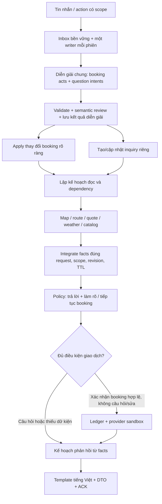

# Kế hoạch MVP ParrotGo — hội thoại V2

Cập nhật: 03/10/2026. Đây là file kế hoạch MVP duy nhất của dự án, hợp nhất phạm vi chat, vận hành và phục hồi của bản đầu với yêu cầu hội thoại V2. Mã nguồn nằm trong `src/backend`, `src/frontend` và `src/scripts`.

Kế hoạch mã nguồn cho Groq/Gemini dự phòng, giải thích thời gian, xác nhận địa điểm và địa danh rộng nằm tại [mục 22](#upgrade-plan). Mục này là công việc dự kiến, chưa phải capability đã triển khai. Các bảng version hiện tại bên dưới tiếp tục mô tả V2.

Bot nhận lời khách dạng văn bản và trả lời bằng văn bản qua HTTP hoặc `app.text.main`. Booking và giá là sandbox. Gemini diễn giải lời khách, VietMap xác minh địa điểm/tuyến, Open-Meteo cung cấp dự báo; ASR/TTS và điều phối xe thật là hướng mở rộng.

| Tài liệu | Phạm vi |
| --- | --- |
| [README.md](README.md) | Cài đặt, cấu hình, lệnh chạy và ví dụ sử dụng. |
| [langgraph.md](langgraph.md) | Graph, state, quyền xác nhận, ledger và phục hồi. |
| [llmextractor.md](llmextractor.md) | `TurnInput`, kết quả diễn giải V2, evidence và tương thích NLU cũ. |
| [map.md](map.md) | `MapAdapter`, `MapResolution`, `Place`, tuyến và dữ liệu địa phương. |
| [llmplanner.md](llmplanner.md) | Phản hồi văn bản hiện tại và hướng mở rộng voice/audio. |
| [MVP_STATUS.md](MVP_STATUS.md) | Kết quả kiểm chứng, báo cáo và giới hạn đã công bố. |
| [Backend README](src/backend/README.md) | API và các module backend. |

Kế hoạch chốt yêu cầu sản phẩm. Các model trong `src/backend/app/contracts` chốt cấu trúc dữ liệu đang thực thi; thay đổi cấu trúc phải cập nhật đồng bộ code, đặc tả, ví dụ và version. `MVP_STATUS.md` ghi bằng chứng đã đạt, không thay thế mục tiêu nghiệm thu. Các yêu cầu hoặc số liệu có nhãn mục tiêu/mở rộng chưa được coi là capability đã triển khai.

## 1. Kết quả cần đạt

ParrotGo hiểu một tin nhắn có nhiều ý, trả lời câu hỏi bằng dữ liệu có nguồn và tiếp tục đặt xe đúng ngữ cảnh. Khách có thể hỏi thử giá, khoảng cách hoặc thời gian của một tuyến khác, so sánh rồi mới quyết định dùng tuyến đó.

Các hành vi cần thể hiện:

1. Khách đang đặt A → B, hỏi giá C → D: bot trả lời C → D, chuyến A → B giữ nguyên.
2. Khách nói “Dùng tuyến vừa hỏi để đặt”: bot chuyển đúng tuyến đã hỏi sang draft sau khi kiểm tra ngữ cảnh; trình bày tóm tắt mới trước khi tạo đơn.
3. Khách nhập địa chỉ cụ thể, bản đồ có một thực thể khớp rõ: bot nhận địa chỉ, đọc lại ngắn gọn, tiếp tục thu thập thông tin; không bắt chọn vì có các kết quả phụ không phù hợp.
4. Khách nhập “gần trường…” hoặc “đối diện ủy ban…”: bot tìm địa danh mốc trước, chỉ hỏi phần còn thiếu để xác định chỗ đón.
5. “Bạn là ai?”, “Có xe gì?”, “Mất bao lâu?”, “Bao giờ đón?” được phân biệt; không rơi vào một câu trả lời chung.
6. Câu hỏi vẫn được trả lời khi đơn đã tạo hoặc đã hủy. Việc hỏi thông tin không mở lại đơn hay sửa đơn đã tạo.
7. Giới hạn Gemini 15 request trong cửa sổ 60 giây được giữ cho toàn bộ ứng dụng, các phiên, repair và evaluation.

Ver2 tiếp tục dùng booking sandbox và giá sandbox cho tới khi có adapter vận hành thật. Tài liệu này không mở thêm thanh toán, tài xế thật, đặt trước, nhiều điểm dừng, khứ hồi hay sửa đơn đã tạo.

## 2. Hiện trạng triển khai và phần còn lại

| Thành phần | Hiện trạng V2 | Công việc tiếp theo |
| --- | --- | --- |
| Hội thoại | Booking và inquiry có scope riêng; resume/promote có guard. | Holdout độc lập, tăng bao phủ câu tự nhiên và tham chiếu phức tạp. |
| Địa chỉ | Tự nhận theo bằng chứng, kiểm tra số nhà/địa bàn, resolve mốc trước điểm hẹn. | Bộ địa chỉ gold và dữ liệu địa phương được review cho vùng phục vụ. |
| Tám nhóm câu hỏi | Có handler cho identity, giá, khoảng cách, catalog, thời gian đón, weather, giá đắt và duration. | Kiểm chứng chất lượng theo cohort và xử lý phần chưa có nguồn. |
| Catalog | Ô tô 4/7 chỗ bật; xe máy điện có schema/profile nhưng mặc định tắt. | Tariff, capacity, hành lý, trẻ em và vùng vận hành trước khi bật xe máy điện. |
| Weather | Open-Meteo thật; fixture có nhãn mẫu, kiểm tra coverage/timezone/TTL. | Xác nhận gói/điều kiện sử dụng khi đưa vào dịch vụ thương mại. |
| Graph/phục hồi | Ba node V2, checkpoint interpretation và prepare; inbox và sandbox ledger bền vững. | Giữ regression recovery; kiến trúc nhiều process là backlog. |
| Chất lượng | 409 pytest và 6 browser E2E đã đạt; live subset có báo cáo. | Chưa có holdout độc lập 160 ca hội thoại, 400 ca địa chỉ và 20 hội thoại nghiệm thu. |

Sáu slot cốt lõi trước create là pickup, destination, pickup_time, passengers, vehicle_type và contact_phone. Các slot khác theo điều kiện. Hỏi giá/khoảng cách/weather không bắt khách cung cấp điện thoại hoặc toàn bộ sáu slot.

## 3. Xem xét lại câu trả lời được gợi ý

| Gợi ý của chủ dự án | Quyết định trong kế hoạch |
| --- | --- |
| Giới thiệu bot là parrotgo. | Dùng thương hiệu **ParrotGo**; nói rõ là trợ lý đặt xe, không nhận mình là tài xế hoặc nhân viên đang trực. |
| Tính giá hai địa điểm khách đưa, kể cả khác slots. | Đồng ý; đây là inquiry độc lập. Chỉ chuyển thành chuyến đặt khi có yêu cầu rõ. |
| Tính khoảng cách A → B. | Đồng ý; trả khoảng cách theo tuyến đường và phương tiện, phân biệt với khoảng cách đường thẳng. |
| Xe máy điện tối đa một người lớn hoặc một người lớn cùng một trẻ em; ô tô 4/7 chỗ. | Ghi nhận là catalog sản phẩm mục tiêu. Cần triển khai đồng bộ quy tắc thành phần hành khách, tariff và profile tuyến; tên “4/7 chỗ” không tự quyết định số khách được chở. |
| Cố gắng sắp xếp đón nhanh nhất; hỏi thời gian nếu thiếu. | Giữ tinh thần lịch sự. Chỉ dùng lời hứa sắp xếp khi có vận hành thật; bản sandbox phải nói đang thử nghiệm. Không tự đoán số phút xe đến. |
| API thời tiết miễn phí hoặc Open-Meteo. | Open-Meteo đã được chọn và có adapter thật/fixture. Giữ boundary độc lập với provider; chọn gói phù hợp mục đích sử dụng trước khi bật cho dịch vụ thương mại. |
| “Đây là giá rất cạnh tranh trên thị trường, quý khách có thể tin tưởng chúng tôi.” | Không dùng như khẳng định mặc định vì chưa có dữ liệu so sánh thị trường. Thay bằng ghi nhận băn khoăn, giải thích giá có nguồn và đề nghị xem phương án phù hợp hơn. |
| Ước lượng thời gian A → B. | Đồng ý; dùng duration của route, làm tròn hợp lý, ghi là ước tính và không lẫn với thời gian tài xế tới đón. |

Các mẫu lời đáp dưới đây là đề xuất giọng điệu. Số tiền, quãng đường, thời gian, nhiệt độ và địa chỉ phải lấy từ facts, không chép các số minh họa thành dữ liệu thực.

## 4. Các nguyên tắc bắt buộc

### 4.1. Giữ đúng chuyến khách đang đặt

- BookingState tiếp tục chứa 12 slot hiện tại. InquiryState chứa địa điểm, phương tiện và thời điểm khách hỏi thử.
- Địa điểm xuất hiện trong câu hỏi giả định chỉ vào inquiry. Không dùng quy tắc “thấy hai địa chỉ thì cập nhật pickup/destination”.
- Một lượt có thể vừa sửa booking vừa hỏi inquiry. Từng phần phải có bằng chứng riêng từ câu khách.
- Hỏi thông tin không làm tăng booking_revision, xóa slot, đổi tuyến hoặc đổi quote của booking. Quote hiện hành vẫn có thể hết TTL theo thời gian.
- Thay đổi metadata ảnh hưởng capacity/điểm hẹn cũng là thay đổi nghiệp vụ: tăng revision, cập nhật snapshot fingerprint và hỏi xác nhận lại khi cần; không giới hạn cơ chế này chỉ ở 12 giá trị slot.
- Hỏi về “chuyến này” chỉ đọc snapshot booking phù hợp; đơn đã tạo dùng committed snapshot cho thông tin chuyến đã chốt.
- Khách chọn candidate của inquiry chỉ cập nhật inquiry. Nút “Dùng tuyến này” là action riêng; nút đó không đồng nghĩa “Đặt xe”.

### 4.2. Giữ đúng quyền xác nhận

- Áp dụng toàn bộ nội dung lượt trước khi xét create/cancel.
- “Đồng ý, nhưng đi bao lâu?” chỉ trả lời câu hỏi; không tạo đơn và không lưu đồng ý đó để tự tạo ở lượt sau.
- “Ừ”, “được”, “chọn cái đầu” gắn với prompt đang được trả lời, có scope và bằng chứng đã trình bày.
- Sau hỏi thử tuyến khác, một “đồng ý” mơ hồ không được xác nhận tóm tắt booking trước đó. Cần nêu lại chuyến hoặc cho khách chọn hành động rõ.
- Dữ liệu địa chỉ tự nhận không phải consent tạo đơn. Tóm tắt cuối cùng và guard hiện tại vẫn bắt buộc.
- Candidate/quote cũ, kết quả đọc về sau khi khách sửa, action sai phiên hoặc sai revision phải bị từ chối.
- Inquiry tuyệt đối không gọi create/cancel. Các guard ledger/idempotency/ACK/TTL/ingress hiện tại tiếp tục áp dụng.

### 4.3. Trả lời có căn cứ, hỏi vừa đủ

- Model nhận diện ý nghĩa; backend tính toán, lấy facts và quyết định hành động.
- Không suy giá, dự báo thời tiết, ETA tài xế hoặc đường đi bằng kiến thức chung của Gemini.
- Tách giá tham khảo, giá hiện hành của draft và giá đã chốt của đơn.
- Trả lời ý khách hỏi trước; nếu cần tiếp tục đặt xe thì chỉ nối một câu hỏi hữu ích.
- Pure inquiry không bắt khách đi qua luồng thu thập liên hệ. Đã đủ thông tin để trả lời thì trả lời ngay.
- Địa chỉ hoặc dữ liệu nguồn còn mơ hồ thì hỏi đúng thành phần thiếu; không yêu cầu nhập lại toàn bộ nội dung đã rõ.

## 5. Kiến trúc V2 và các bước nghiệp vụ



Quyết định giao dịch phải kiểm tra guards sau khi tích hợp facts và sau mọi sửa đổi. Policy trả lời không được bỏ qua trạng thái booking_unknown/cancel_unknown.

Sơ đồ trên biểu diễn các bước nghiệp vụ. Topology thực thi trong [graph/builder.py](src/backend/app/graph/builder.py) là:


`interpret_turn` lưu diễn giải; `prepare_turn` áp dụng/chuẩn bị facts có binding; `process_turn` kiểm tra lại guard, thực hiện effect được phép và dựng phản hồi. Các tên như `apply_acts` hay `render_response` trong mô tả nghiệp vụ không phải node độc lập của graph hiện tại. Runner legacy dùng một node `process_turn` khi engine không có `interpret`/`prepare`.

### 5.1. Giữ một inference cho một lượt thông thường

Extractor V2 dùng `TurnInput` và class `TurnResult` trong [contracts/turn.py](src/backend/app/contracts/turn.py). Tài liệu gọi kết quả này là **ExtractorTurnResult** để phân biệt với phản hồi bot `AssistantResponse`; đây là bí danh mô tả, không đổi tên class trong code.

| Trường output V2 | Nội dung |
| --- | --- |
| contract_version | Chính xác `parrotgo-turn-2`. |
| speech_status | `clear`, `low_confidence`, `no_speech` hoặc `noise`. |
| booking_acts | Tối đa 24 act booking; mỗi act có `evidence_span`. |
| questions | Tối đa 8 `QuestionIntent` có scope và evidence. |
| inquiry_actions | Tối đa 8 hành động inquiry, có evidence. |
| conversational_acts | Tối đa 8 mã greeting/thanks/repeat/out_of_scope/unclear. |
| travel_party | Null hoặc số người lớn/trẻ em có evidence; không phải slot thứ 13. |

Không có field `evidence` ở cấp gốc; evidence nằm tại `evidence_span` của từng phần tử nghiệp vụ và travel_party. Input V2 kế thừa năm trường NLU cơ sở và thêm contract_version, inquiries, active_inquiry_id, pending_prompt, capabilities, occurred_at và timezone. Xem schema và ví dụ đầy đủ trong [llmextractor.md](llmextractor.md).

QuestionIntent tối thiểu:

- question_id, type, raw_text, evidence_span;
- route_scope: explicit_pair / active_inquiry / current_booking / unresolved;
- origin và destination: raw_text hoặc reference có scope; null nếu thiếu;
- vehicle_ref, departure_time_ref, weather_target nếu cần;
- relation_to_booking: read_only / hypothetical / explicit_update; backend kiểm tra lại;
Dependency/fingerprint và nhu cầu làm rõ được domain giữ trong state/facts; không có field `dependency_refs` hoặc `clarification_needed` trong model QuestionIntent hiện tại.

Các type bắt buộc: identity, fare_estimate, route_distance, vehicle_catalog, pickup_availability, weather_forecast, price_objection, travel_duration. Bổ sung other_booking_question, chit_chat, out_of_scope và unclear để không ép mọi câu vào tám nhóm.

Không gọi một LLM thứ hai để phân loại question hoặc diễn đạt đáp án trong đường xử lý chuẩn. Template có biến và các biến thể lịch sự tạo câu trả lời từ ResponsePlan. Nếu sau này thử renderer LLM, đó là experiment riêng với quota và facts guard, không là dependency nghiệm thu ver2.

### 5.2. State và scope hiện tại

| Nhóm state | Vai trò |
| --- | --- |
| inquiries | Các inquiry đang hỏi và gần đây; mỗi inquiry có ID, revision, pair, vehicle/time assumptions, candidates, facts, TTL, status. |
| active_inquiry_id | Tuyến đang được thảo luận; không thay current booking. |
| dialogue.pending_prompt | Prompt đang chờ trả lời: purpose, scope_kind, scope_id, field, revision, response_id, generation, expires_at. |
| dialogue.suspended_booking_prompt | Điểm tiếp tục booking trước câu hỏi xen ngang; khi resume phải kiểm tra revision và không phục hồi consent cũ. |
| dialogue.last_discussed_route_ref | Nguồn cho “tuyến đó”, “hai chỗ vừa hỏi”; không dựa vào việc nhặt hai địa chỉ gần nhất trong transcript. |
| dialogue.pending_questions | Câu hỏi chưa đủ dữ kiện, đã trả lời hoặc đang chờ nguồn. |
| travel_party | Metadata có nguồn về số người lớn/trẻ em khi cần capacity; mỗi booking/inquiry có scope riêng, không là slot thứ 13 tự động bắt mọi khách trả lời. |
| read_requests/read_facts | Request ID, scope, dependency fingerprint, source, fetched_at, valid_until, status. |

Chốt giới hạn ban đầu: tối đa 5 inquiry gần đây/phiên; inquiry cần làm rõ có TTL 10 phút cấu hình được. Hết hạn vẫn có thể đọc lịch sử hiển thị, nhưng chọn/promote phải resolve và tính lại khi cần.

NLU projection chỉ đưa prompt đang hoạt động, booking hiện tại và inquiry/reference cần dùng, với giới hạn độ dài rõ. Giữ lịch sử đầy đủ ở storage, không gửi toàn bộ transcript hoặc mọi kết quả provider trong mỗi request. Nếu một tin nhắn có quá nhiều tuyến, hỏi thứ tự ưu tiên và giữ các yêu cầu còn lại thay vì âm thầm bỏ.

Phải tách:

- **last presented response**: đã render, có ACK;
- **active answer prompt**: câu hỏi khách đang trả lời;
- **booking confirmation prompt**: scope snapshot được phép xác nhận.

Một response có thể trả lời nhiều câu hỏi nhưng chỉ có một prompt chính đang chờ input. Bộ candidate đặt xe bị tạm ngưng không được hiểu nhầm thành candidate hỏi thử.

### 5.3. Booking và inquiry dùng chung dịch vụ đọc

Map/route/quote/weather được gọi bằng request đã validate, với scope_kind và scope_id. Một writer duy nhất tích hợp kết quả vào đúng phần state.

Có thể tái sử dụng facts nếu toàn bộ fingerprint và độ tươi phù hợp. Không chia sẻ user confirmation, không dùng quote inquiry như quote booking mà không kiểm tra lại toàn bộ dependency.

## 6. Luồng hội thoại xen ngang

### 6.1. Trình tự xử lý một lượt

1. Nhận inbox event, dedup; lấy state và các prompt đã trình bày.
2. Đường tắt FAQ chỉ áp dụng toàn bộ tin nhắn khớp mẫu đơn nghĩa được allowlist. Câu có địa chỉ, sửa đổi, phủ định, xác nhận, hủy hoặc nhiều ý phải qua extractor chung.
3. Diễn giải một lần; validate schema, catalog, spans, references và candidate scope.
4. Phân tách rõ booking updates, câu hỏi, thông tin giả định và control acts.
5. Áp dụng booking updates có bằng chứng; tăng revision và invalidate dependency đúng phần bị đổi.
6. Tạo inquiry cho route giả định; lưu/suspend focus booking nếu có.
7. Lập kế hoạch đọc dùng chung, fan-out các lookup độc lập trong giới hạn; không chạy thêm agent/model để chọn tool.
8. Chỉ integrate kết quả còn hợp lệ; ghi đủ facts đã dùng cho câu trả lời.
9. Trả lời các câu hỏi đã đủ dữ kiện; với câu thiếu, hỏi thành phần chặn trả lời.
10. Nếu khách còn đang đặt và không có prompt inquiry cần ưu tiên, resume câu hỏi booking phù hợp. Đã đủ slots thì trình bày lại tóm tắt hợp lệ.
11. Chỉ xét giao dịch với consent riêng hợp lệ; câu hỏi/sửa/điều kiện trong lượt chặn create.
12. Checkpoint, publish và ACK theo cơ chế bền vững hiện tại.

### 6.2. Quy tắc ưu tiên phản hồi

| Tình huống | Phản hồi |
| --- | --- |
| Một câu hỏi đủ facts | Trả lời trực tiếp; thêm tối đa một câu nối booking nếu hữu ích. |
| Nhiều câu hỏi đủ facts | Trả lời các ý theo thứ tự khách hỏi; gộp route/quote lookup. |
| Một câu đủ facts, một câu thiếu | Trả lời phần đã biết trước, hỏi phần thiếu sau. |
| Booking thiếu phone, inquiry thiếu điểm B | Hỏi điểm B cho inquiry; không hỏi phone để tính giá thử. |
| Khách trả lời booking focus trong khi vừa hỏi thử | Dựa vào reply_to/prompt scope và evidence; không mặc định mọi câu ngắn thuộc inquiry. |
| Hai prompt có thể cùng nhận “cái đầu/ừ” | Hỏi khách đang chọn địa điểm hay xác nhận chuyến nào. |
| Câu ngoài phạm vi thuần túy | Chuyển hướng ngắn, không sửa state hoặc tuyên bố đã hỗ trợ việc ngoài khả năng. |
| Đơn đã tạo | Cho hỏi thông tin; sửa đơn vẫn giữ quy tắc hiện tại, không âm thầm amendment. |
| Đơn đã hủy | Cho hỏi độc lập; đặt tiếp cần draft/session mới rõ ràng. |
| Giao dịch chưa rõ kết quả | Giữ trạng thái đối soát; FAQ/thông tin đọc được vẫn trả lời, không mở giao dịch mới. |

### 6.3. Ví dụ bắt buộc

**Xen ngang không sửa chuyến**

- Bot: “Bạn cho mình số điện thoại liên hệ nhé.”
- Khách: “Khoan, từ C đến D bao nhiêu tiền?”
- Bot: “Với tuyến C → D, giá tham khảo cho … là … Bạn muốn dùng tuyến này hay tiếp tục chuyến A → B?”
- Khách: “Tiếp tục chuyến cũ, số mình là …”
- Kết quả: cập nhật phone của A → B; C → D không được ghi vào booking slots.

**Một lượt vừa sửa vừa hỏi**

- Khách: “Đổi điểm đón sang A, còn nếu đi C đến D thì mất bao lâu?”
- Kết quả: pickup booking đổi thành A; inquiry C → D có route riêng; trả duration của C → D và tiếp tục booking từ A.

**Xác nhận kèm câu hỏi**

- Khách: “Đồng ý, nhưng xe tới đón trong mấy phút?”
- Kết quả: trả lời khả năng đón, không create; sau trả lời cần xác nhận riêng với tóm tắt còn hiệu lực.

**Thông tin dùng cho hỏi thử**

- Khách: “Nếu đi xe 7 chỗ từ C đến D lúc 8 giờ thì giá thế nào?”
- Kết quả: vehicle/time thuộc inquiry; không đổi vehicle/time của A → B, không tạo issue đặt trước cho booking A → B.

## 7. Tự nhận địa chỉ cụ thể

### 7.1. Những gì cần phân biệt

Độ chắc chắn của thực thể, độ chính xác của tọa độ và độ phù hợp làm điểm đón là ba việc khác nhau. Một kết quả khớp tên đường chưa chắc là số nhà. Một POI đúng chưa chắc đã xác định cổng đón.

Tự nhận chỉ có nghĩa chọn được điểm từ nguồn và thông báo cho khách. Slot có bằng chứng khách cung cấp, map resolution hợp lệ; không tự đánh dấu khách đã đồng ý tạo đơn.

### 7.2. Pipeline

1. Giữ raw_text; parser lấy số nhà, ngõ/hẻm, đường, địa danh, địa bàn, cổng và constraint phủ định.
2. Chuẩn hóa khóa tra cứu riêng: dấu, khoảng trắng, viết tắt đã xác minh; không bỏ hậu tố số nhà hoặc nhánh ngõ.
3. Chọn area context có nguồn: địa bàn khách nói, địa bàn đã xác nhận trong phiên hoặc service area công bố. Không âm thầm mặc định Hà Nội cho mọi phiên.
4. Search VietMap; nhận các kết quả có thể phù hợp. Không dùng thứ hạng đầu làm bằng chứng quyết định.
5. Lấy place details cho các ứng viên có thể cạnh tranh; lọc hard conflicts.
6. Phân biệt duplicate cùng thực thể với chi nhánh/cổng khác nhau. Chỉ merge khi có cùng provider identity hoặc crosswalk có nguồn; gần tọa độ không đủ.
7. Xét evidence và đối thủ còn phù hợp; kiểm tra số nhà, đường, khu vực, granularity và meeting/access constraints.
8. Auto-accept, hiển thị lựa chọn hoặc hỏi chi tiết thiếu; ghi reason_codes.
9. Integrate theo request_id, scope, revision và fingerprint; kết quả về trễ không ghi đè thông tin mới.

Adapter hiện tại gọi search, dùng autocomplete nếu search rỗng, rồi lấy detail cho tối đa 3 thực thể đã loại trùng. Chỉ tự nhận khi còn một candidate khớp, số thực thể đã xét không vượt giới hạn và không còn yêu cầu chọn cổng. Trường hợp chưa đủ bằng chứng trả ambiguous. Mở rộng ngân sách lookup là công việc phải đo và kiểm thử, chưa có nhánh mở thêm 2 detail trong runtime.

### 7.3. Điều kiện tự nhận

| Bằng chứng | Quy tắc |
| --- | --- |
| Số nhà | Khớp đầy đủ khi khách đưa; 65 khác 650, 65A khác 65, 65/2 khác 65. |
| Đường/ngõ/hẻm | Khớp theo cấu trúc hoặc alias đã xác minh; không xóa đoạn ngõ vì provider chỉ biết đường lớn. |
| Địa bàn | Không có xung đột với dữ kiện rõ của khách; địa danh trùng ở hai tỉnh chưa được loại trừ thì hỏi. |
| Loại kết quả | Có granularity phù hợp mục đích; kết quả chỉ cấp đường/phường không thay số nhà. |
| Đối thủ | Không còn thực thể khác có bằng chứng tương đương; raw rows nhiều nhưng không phù hợp không tự tạo ambiguity. |
| Cổng/điểm hẹn | Không có lựa chọn cổng/phía cần thiết chưa giải quyết. |
| Constraint | Bảo toàn “không phải…”, “cổng đường…”, mốc cụ thể và phần khách chưa chắc. |
| Tọa độ và nguồn | Có tọa độ hợp lệ từ provider, identity/source và thời điểm; không tự suy từ tên. |

Tiêu chí thiết kế phân biệt khớp chính xác, khớp có bằng chứng mạnh, mơ hồ, thiếu dữ liệu và nguồn không sẵn sàng. Đây không phải enum hoặc field bổ sung trong MapResolution; status runtime vẫn là resolved/ambiguous/not_found/unavailable. Nếu sau này dùng score thì chỉ là score xếp hạng có version; không gọi đó là xác suất chính xác khi chưa calibration. Gemini không tự cấp confidence để vượt hard gates.

Tập hợp một candidate hợp lệ sau lọc **không tự đủ** nếu còn kết quả chưa được kiểm chứng có thể cạnh tranh hoặc provider không có evidence cho số nhà.

### 7.4. Phản hồi

- Đủ chắc chắn: “Mình đã nhận điểm đón tại {địa chỉ có nguồn}. Bạn muốn đón khi nào?”
- Chưa có địa bàn: “65 phố Nhổn bạn nói ở Hà Nội phải không?” Chỉ nêu Hà Nội nếu có ứng viên/ngữ cảnh hỗ trợ.
- Hai thực thể tương đương: đưa 2–3 nhãn phân biệt bằng đường/khu vực.
- Provider chỉ trả đầu đường: “Mình tìm được phố Nhổn nhưng chưa xác định được số 65. Bạn có thể bổ sung ngõ hoặc điểm gần đó không?”
- Sai số nhà/địa bàn: không tự sửa ý khách sang kết quả đầu.

“65 phố Nhổn” là ca nghiệm thu bằng response provider được lưu và đối chiếu; tài liệu không khẳng định mọi lần lookup thực đều có cùng kết quả.

### 7.5. Cache và sửa địa chỉ

Cache facts theo query components, area context, provider/version, alias/admin dataset, purpose và granularity. Tách cache địa điểm khỏi quyết định auto-accept có phụ thuộc ngữ cảnh.

Thay số nhà, ngõ, cổng hoặc phía đón làm lại những dependency bị ảnh hưởng. Sửa cách viết tương đương chỉ giữ resolution nếu chứng minh same_entity và constraints không đổi. Không phục hồi quote/consent cũ chỉ vì label giống nhau.

## 8. Mở rộng địa chỉ dân dã và địa phương

### 8.1. Phạm vi triển khai theo tầng

| Tầng | Hỗ trợ | Cách làm |
| --- | --- | --- |
| B1 | Viết tắt, lỗi gõ thông dụng, tên POI phổ biến | Normalizer có version + VietMap search; tên riêng sửa không chắc thì xác nhận. |
| B2 | Tên dân gian/tên cũ | Alias registry theo khu vực, có source, canonical identity và thời hạn nếu cần. |
| B3 | “Gần”, “cạnh”, “đối diện”, “sau” một mốc | Resolve anchor trước, sau đó làm rõ meeting point. |
| B4 | Ngã tư, cổng, nhà ga, nhiều lối vào | Dữ liệu entrance/meeting point có nguồn + câu hỏi chọn phía/cổng cần thiết. |
| B5 | “Rẽ trái…”, “chưa qua cầu…”, “nhà hôm qua…” | Nhận diện phần không đủ reference; hỏi mốc/địa chỉ. Chưa hứa giải mọi hướng dẫn địa phương. |

Ưu tiên một vùng có bộ địa chỉ kiểm chứng trước rồi mở rộng. Service area phải là cấu hình công bố, không là giả định giấu trong parser.

### 8.2. ParsedLocation hiện tại

Model [contracts/location.py](src/backend/app/contracts/location.py) có các field `raw_text`, `normalized_query`, `house_number`, `alley_path`, `anchor_name`, `relation`, `qualifier`, `uncertainties`, `excluded_entities` và `parser_version=location-parser-2`.

`relation` nhận near/opposite/adjacent/behind/left_of/right_of/between/none. Parser giữ nguyên raw text, hỗ trợ một tập quy tắc có giới hạn; field tồn tại không chứng minh đã phân tích đầy đủ mọi phủ định hoặc địa chỉ tự nhiên. Thành phần địa chỉ từ provider và nguồn alias nằm trong `Place.address_components`/`Place.metadata`, không tự thêm field ngoài schema ParsedLocation.

“Áo đỏ đứng chờ” có thể là pickup_note. “Đứng đối diện cổng đường X” ảnh hưởng địa điểm, cần làm rõ điểm hẹn sau khi resolve mốc. Dữ liệu địa giới theo thời gian, access checks và ngữ nghĩa phủ định đầy đủ là yêu cầu mở rộng có bộ gold riêng.

### 8.3. Các trường hợp bắt buộc

| Câu khách | Luồng |
| --- | --- |
| “Đối điện tòa uỷ bạn huyện ABC” | Đề xuất chuẩn hóa “đối diện/ủy ban”, tra anchor trong địa bàn. Không sửa tùy tiện tên riêng ABC. Tìm được tòa nhà vẫn chưa tự có điểm đón bên kia đường. |
| “Gần tiểu học XYZ” | Tìm trường đúng khu vực; hỏi khách chọn cổng trường làm điểm hẹn hay địa chỉ cụ thể gần đó. |
| “Đối diện UBND huyện ABC” | Xác định tòa nhà/cổng đã nói; hỏi một chi tiết phân biệt bên đối diện nếu chưa có meeting point từ nguồn. |
| “Ngã Tư Sở” | Tra POI/alias đúng thực thể; pickup cần thêm đường/phía khi việc đón đòi hỏi. Inquiry khoảng cách có thể dùng mốc đại diện nếu công bố rõ độ xấp xỉ và khách chấp nhận. |
| “Cổng sau bệnh viện XYZ” | Tra entrance có nguồn; không có dữ liệu cổng sau thì hỏi đường/tên cổng, không dùng cổng chính. |
| “Giữa trường X và chợ Y” | Resolve hai anchor nếu đủ địa bàn; cần điểm hẹn cụ thể, không lấy trung điểm tọa độ làm vị trí khách. |
| “Không phải trường XYZ ở quận A, ở khu B” | Giữ phủ định và địa bàn B trong request; loại kết quả quận A. |
| “Nhà tôi/chỗ hôm qua” | Chỉ dùng reference đã lưu và được xác định rõ trong phiên; nếu chưa có thì hỏi địa chỉ. |

Không cộng/trừ tọa độ một khoảng tùy ý để tạo “đối diện”. Không biến landmark center thành điểm đón cụ thể khi chưa có bằng chứng.

### 8.4. Chốt điểm hẹn

Nếu khách đồng ý “đón ở cổng chính trường”, đó là lựa chọn meeting point mới có evidence. Nếu có tọa độ cổng từ nguồn, dùng cổng. Nếu chỉ có tọa độ trường, giữ distinction anchor/meeting point và giới hạn độ chính xác; không đánh dấu đã tìm chính xác cổng.

Chỉ dùng location cho booking khi đạt yêu cầu granularity/access của dịch vụ. Nếu chưa đạt, giữ unresolved issue và hỏi bổ sung. Inquiry tham khảo có thể dùng landmark đại diện theo policy riêng, nhưng phải ghi rõ “tính từ khu vực…”, không đưa quote đó thẳng vào booking.

Nếu cuối cùng chưa tìm được chỗ đón, đề nghị một điểm hẹn có nguồn gần đó và chờ khách chọn. Không tự thay nhà khách bằng đầu ngõ, cổng khác hoặc địa điểm thuận tiện cho hệ thống.

## 9. Quy tắc chung cho các câu hỏi về tuyến

### 9.1. Chọn đúng A và B

Thứ tự xác định phạm vi:

1. Hai địa điểm khách nêu rõ trong câu hỏi: dùng hai địa điểm đó cho inquiry.
2. Reference rõ như “hai chỗ vừa hỏi”, “đảo chiều tuyến đó”: dùng đúng inquiry có ID được thảo luận.
3. “Chuyến này”, “từ điểm đón đến điểm đến đã chọn”: đọc booking snapshot.
4. Không nêu địa điểm, nhưng active inquiry/prompt chỉ có một cách hiểu: tiếp tục inquiry đó.
5. Còn nhiều cách hiểu: hỏi scope, không tự lấy đôi địa chỉ gần nhất hoặc ghép một nửa từ booking với một nửa từ inquiry.

Nếu khách chỉ đưa B, có thể đề xuất dùng pickup hiện tại làm A nhưng phải nêu rõ hoặc hỏi xác nhận khi ý khách chưa đủ rõ. Ví dụ: “Bạn muốn tính từ điểm đón A đang chọn đến B, hay từ một nơi khác?”

Một câu thuần “từ A đến B bao nhiêu tiền?” là hỏi thử mặc định, kể cả A/B trùng slots. Chỉ động từ đặt/đổi rõ và context đã xác minh mới sinh booking update.

### 9.2. Vòng đời inquiry

Inquiry hiện được tạo với status `new`, chuyển sang `awaiting_endpoint` khi thiếu đầu/cuối, `awaiting_candidate` khi địa điểm cần làm rõ, `answered` khi đã có kết quả đọc và `promoted` khi dùng tuyến cho draft. `status` là string trong model projection, không phải enum có thêm awaiting_vehicle/ready/expired/abandoned.

Hết hạn được kiểm tra bằng `expires_at`; dismiss/resume xử lý focus/prompt. Không suy trạng thái hết hạn hoặc quyền promote chỉ từ status. Đổi xe/thời gian có thể cần làm rõ bằng prompt mà không có một status riêng tương ứng.

Trong một inquiry, khách có thể đổi B, đổi phương tiện hoặc hỏi thêm khoảng cách/thời gian. Tăng inquiry_revision và invalidate đúng facts; booking_revision không đổi.

Đảo A → B thành B → A cần route mới hoặc cache đúng chiều. Không giả định tuyến một chiều, giá và duration đối xứng.

### 9.3. Candidate và action có scope

Candidate set nội bộ giữ ID, field, revision, TTL và response đã trình bày. PublicCandidate chứa candidate_id/candidate_set_id/target/ordinal/label, stop_ref và scope_kind/scope_id/revision; response_id/generation và valid_until thuộc PublicPresentation. Inquiry origin được chiếu thành target pickup. ID set phải đủ để server tra và validate; client không được tự quyết định binding hoặc gộp các field này thành một model mới.

Typed actions hiện tại trong [contracts/chat.py](src/backend/app/contracts/chat.py), được bọc bởi ActionInput với client_action_id và delivery/reply references:

| type | Field bắt buộc ngoài type | Ý nghĩa |
| --- | --- | --- |
| select_candidate | candidate_set_id, candidate_id | Chọn trong set đã trình bày, server kiểm tra scope/revision/TTL. |
| use_inquiry_route | inquiry_id, inquiry_revision, route_fingerprint, booking_revision | Dùng tuyến hỏi thử cho draft; chưa đồng ý tạo đơn. |
| choose_inquiry_vehicle | inquiry_id, inquiry_revision, vehicle_type | Chọn xe để tính thử, không chọn xe cho booking. |
| dismiss_inquiry | inquiry_id, inquiry_revision | Đóng phạm vi hỏi thử, không sửa booking slots. |
| resume_booking | Không có field bổ sung | Tiếp tục draft đang đặt, không khôi phục consent cũ. |
| confirm_booking | prompt_id, booking_revision, snapshot_fingerprint | Xác nhận summary hiện hành, vẫn phải vượt mọi guard. |
| cancel_booking | booking_id | Đề nghị hủy đơn sandbox đã tạo. |
| cancel_draft | draft_id | Hủy draft hiện tại. |

“Chọn cái đầu” chỉ có hiệu lực với bộ candidate đang được trình bày và đúng scope. Nếu đang hỏi điểm B cho inquiry thì không chọn điểm đón booking.

### 9.4. Chuyển inquiry thành booking

1. Nhận yêu cầu rõ: “Đặt tuyến này”, “Lấy hai chỗ vừa hỏi làm điểm đón và đến”.
2. Xác định inquiry được tham chiếu; nhiều inquiry thì hỏi chọn.
3. Kiểm tra revision, TTL, tính cụ thể của điểm và phương tiện.
4. Nêu phạm vi chuyển: chỉ A/B hay cả loại xe/thời gian mà khách đã chọn cho hỏi thử.
5. Điểm thử còn approximate hoặc cổng chưa rõ: làm rõ trước khi dùng cho booking.
6. Ghi booking updates có evidence; giữ phone/tên/thông tin không bị yêu cầu thay.
7. Tăng revision, invalidate snapshot/consent. Reuse map/route facts chỉ nếu dependency phù hợp.
8. Tạo hoặc kiểm tra quote booking có scope booking; không tự biến inquiry quote_id thành bằng chứng chốt giá.
9. Thu thập phần còn thiếu và trình bày tóm tắt mới.
10. Chỉ tạo đơn sau xác nhận riêng hợp lệ.

Nếu đơn cũ đã tạo, “đặt tuyến này” là đề nghị chuyến mới; không sửa đơn cũ và không tự hủy đơn cũ.

## 10. Luồng xử lý từng loại câu hỏi của khách

### 10.1. Hỏi “Bạn là ai?” — identity

**Ví dụ:** “Bạn là ai?”, “Đây có phải ParrotGo không?”, “Bạn có phải tài xế không?”

**Nguồn:** cấu hình thương hiệu và capability runtime; không gọi Map/quote/weather.

**Luồng:**

1. Nhận diện identity; nếu tin nhắn còn yêu cầu đặt/sửa thì xử lý đủ các ý.
2. Đọc tên thương hiệu, vai trò trợ lý và chế độ sandbox/live.
3. Trả lời ngắn; không nhận mình là tài xế đã được phân công.
4. Chỉ nối câu tiếp tục nếu đang có tiến trình booking và không có câu hỏi khác cần ưu tiên.

**Mẫu:**

> Mình là trợ lý đặt xe của ParrotGo. Mình giúp bạn tìm điểm đón, điểm đến, xem giá tham khảo và thực hiện các thao tác đặt xe đang được hỗ trợ.

Ở sandbox, thêm: “Hiện bạn đang dùng bản thử nghiệm, chưa gọi tài xế thật.” Không đưa thuật ngữ Gemini/LangGraph vào giới thiệu cho khách.

**State:** không thay slot/quote/đơn. **Gemini:** 0 cho mẫu thuần khớp allowlist; tối đa 1 cho tin nhắn tự do hoặc nhiều ý.

**Nghiệm thu:** identity được trả lời lúc collecting, awaiting_confirmation, booked, cancelled và unknown; thông tin thương hiệu lấy từ một cấu hình thống nhất.

### 10.2. Hỏi giá với hai địa điểm — fare_estimate

**Ví dụ:** “Từ A đến B hết bao nhiêu?”, “Nếu đi C → D bằng xe 7 chỗ thì giá thế nào?”

**Thông tin tối thiểu:** hai điểm đủ rõ, phương tiện hoặc tập phương tiện muốn so sánh; thời điểm chỉ hỏi nếu tariff thật phụ thuộc và không có căn cứ để dùng giả định công bố.

**Luồng:**

1. Xác định scope theo mục 9; hai điểm được nêu là inquiry mặc định.
2. Resolve A/B bằng cùng pipeline địa chỉ cụ thể/dân dã.
3. Nếu mơ hồ, hỏi địa bàn/candidate cho điểm đó; không yêu cầu phone/passengers để báo giá thử thông thường.
4. Có xe nêu rõ thì dùng xe đó. Nếu thiếu xe, trả bảng nhỏ cho các dịch vụ có tariff hợp lệ và tương thích; nếu chưa tính được thì hỏi khách chọn xe.
5. Mọi xe trong bảng phải có route profile đúng. Ô tô 4/7 có thể chia sẻ route car nếu capability xác nhận; xe máy điện không dùng duration car rồi đổi nhãn.
6. Lấy route theo chiều A → B; gọi quote cho từng lựa chọn cần tính.
7. Trả endpoint labels, loại xe, amount/currency, nhãn tham khảo/thử nghiệm, điều kiện chính và TTL nếu thích hợp.
8. Có thể hỏi “Bạn muốn dùng tuyến này để đặt xe không?” khi phù hợp; không tự promote.
9. Khách chọn tuyến/xe thì chuyển theo mục 9.4 và tiếp tục booking.

**Mẫu:**

> Với tuyến {A} → {B}, giá tham khảo {xe} là {giá}. {Điều kiện giá có nguồn}. Bạn muốn dùng tuyến này để đặt xe không?

Nếu chỉ có giá sandbox: phải dùng “giá thử nghiệm”. Không gán các phí cầu đường/chờ/phụ thu đã bao gồm khi tariff chưa có metadata đó.

**Ngoại lệ:**

- Một đầu chưa rõ: hỏi đầu đó.
- Hai điểm trùng thực thể: hỏi khách có muốn đi trong cùng khu vực/cổng khác; không tự báo 0 đồng.
- Một phương tiện thiếu tariff: trả các phương tiện tính được và nói chưa có giá cho phương tiện đó; không bịa giá.
- Không có route: không lấy khoảng cách đường thẳng để tính cước như tuyến thực.
- Quote inquiry hết hạn: tính lại khi cần; không invalidate quote của chuyến khác.
- Hỏi giá “chuyến đã đặt”: dùng giá đã chốt trong committed snapshot, không tính lại giá đơn cũ.

**State:** query chỉ thay inquiry. **Gemini:** tối đa 1 thông thường. Map/route/quote không dùng quota Gemini.

**Nghiệm thu trọng tâm:** booking A → B không đổi khi hỏi C → D; dùng tuyến hỏi thử cần thao tác rõ; đổi xe trong inquiry không đổi xe booking.

### 10.3. Hỏi khoảng cách — route_distance

**Ví dụ:** “Từ A đến B bao nhiêu km?”, “Hai chỗ này cách nhau mấy mét?”, “Từ C đến D có xa không?”

**Luồng:**

1. Nhận diện distance dựa vào ý nghĩa; không vì “bao nhiêu” mà đi vào fare.
2. Chọn endpoint/scope; resolve và hỏi chỗ thiếu giống fare.
3. Xác định phương tiện nếu tuyến khác nhau đáng kể. Nếu chưa có, có thể dùng ô tô làm giả định được nêu rõ; không ghi giả định đó vào vehicle_type booking.
4. Lấy distance_m của route có nguồn. Chưa có route thì không trả số phỏng đoán.
5. Format dưới 1.000 m bằng mét, còn lại bằng km; làm tròn để dễ đọc, giữ giá trị gốc trong facts.
6. Nêu đó là quãng đường theo tuyến/phương tiện, không phải đường chim bay.

**Mẫu:**

> Từ {A} đến {B}, quãng đường theo tuyến {phương tiện} khoảng {khoảng cách}.

Không bắt chọn loại xe để trả lời nếu đã có một giả định hợp lý được công bố và khách chỉ cần ước lượng. Nếu khách hỏi đường thẳng riêng, trả lời chỉ khi có phép tính và nhãn riêng; không dùng kết quả đó cho quote.

**State:** read-only booking; có inquiry thì lưu route fact. **Nghiệm thu:** “bao nhiêu km/m” không trả giá; đảo chiều được tính đúng; m/km không bị nhầm đơn vị.

### 10.4. Hỏi “Có những loại xe nào?” — vehicle_catalog

**Catalog sản phẩm mục tiêu:**

| Mã đề xuất | Nhãn | Quy tắc hành khách cần hỗ trợ |
| --- | --- | --- |
| xe_may_dien | Xe máy điện | Một người lớn; hoặc một người lớn cùng một trẻ em, theo policy vận hành được cấu hình. Không tự coi hai người lớn là hợp lệ. |
| oto_4_cho | Ô tô 4 chỗ | Số khách/hành lý theo catalog vận hành; tên xe không thay thế capacity cụ thể. |
| oto_7_cho | Ô tô 7 chỗ | Số khách/hành lý theo catalog vận hành; không tự suy từ chữ “7”. |

**Luồng:**

1. Đọc catalog có version và trạng thái dịch vụ: advertised, quote_available, bookable, unavailable.
2. Trả các dịch vụ đang thực sự được hỗ trợ cho mode/service area; tách availability sản phẩm khỏi việc đã có tài xế cụ thể.
3. Nếu đã biết số khách, giải thích lựa chọn phù hợp; không tự chọn xe thay khách.
4. Nếu khách chọn xe máy điện với tổng 2 người, hỏi thành phần người lớn/trẻ em nếu chưa biết.
5. Nếu “hai người lớn”: từ chối capacity xe máy điện và đề nghị ô tô.
6. Nếu một người lớn + một trẻ em: kiểm tra policy/config, hành lý và capability; tổng passengers vẫn là 2.

**Mẫu khi cả ba dịch vụ đã bật đủ capability:**

> ParrotGo hiện có xe máy điện, ô tô 4 chỗ và ô tô 7 chỗ. Xe máy điện phục vụ một người lớn hoặc một người lớn đi cùng một trẻ em theo quy định dịch vụ. Bạn muốn chọn loại xe nào?

Không dùng mẫu này trong runtime vẫn chỉ có hai loại ô tô. Khi đang sandbox, capability đó phải được ghi đúng là thử nghiệm.

**Đầu việc đồng bộ bắt buộc:**

- Registry/prompt/validator NLU có mã xe máy điện.
- Catalog là nguồn chung cho label, capacity, hành lý, route profile và trạng thái.
- Tariff xe máy điện phải có cấu hình; kế hoạch không tự đặt mức tiền.
- Route adapter kiểm chứng profile phù hợp của provider, không mặc định tên enum API.
- Engine thay guard chỉ xét max_passengers bằng guard thành phần hành khách khi phương tiện yêu cầu.
- Summary, snapshot, quote fingerprint, provider payload sandbox, DTO, generated TypeScript và UI cùng hỗ trợ mã mới.
- Thay catalog/tariff/capacity có version; quote và consent bị ảnh hưởng phải xét lại.

Một trẻ em đi một mình, tuổi/phân loại trẻ em và điều kiện cụ thể là policy cần chốt, không suy ra từ gợi ý “một người lớn + một trẻ em”. Không giả định tổng passengers là đủ để kiểm tra xe máy điện.

Khi đã biết thành phần, adults + children phải khớp tổng passengers; unknown không được tự đổi thành 0. Không suy trẻ em từ việc điểm đến là trường học. Thành phần hỏi thử thuộc inquiry; thành phần dùng để đặt phải nằm trong snapshot/summary khi ảnh hưởng điều kiện dịch vụ.

**Nghiệm thu:** lời giới thiệu và khả năng chọn/báo giá/đặt cùng khớp catalog; không vượt capacity bằng cách đếm trẻ em thành 0.

### 10.5. Hỏi “Bao giờ đón được?” — pickup_availability

**Ví dụ:** “Xe tới đón bao lâu?”, “Bao giờ có tài xế?”, “Có đón ngay được không?”

**Phân biệt:** đây là thời gian tài xế tới đón; không phải duration A → B.

**Luồng:**

1. Xác định đang hỏi khả năng chung, draft hiện tại hay đơn đã tạo.
2. Nếu có ETA dispatch được provider cung cấp trong tương lai, trả ETA có nguồn và trạng thái.
3. Nếu chưa có nguồn ETA: không trả số phút; dùng mẫu phù hợp sandbox/live.
4. Nếu khách đang muốn đặt nhưng pickup_time thiếu: trả lời rồi hỏi “Bạn muốn đón khi nào?”
5. Nếu pickup_time đã rõ: không hỏi lại; nhắc đúng yêu cầu đã ghi nhận khi hữu ích.
6. “Đi ngay” chỉ được ghi khi khách yêu cầu/xác nhận, không tự default.
7. Nếu khách muốn thời gian đặt trước mà booking hiện không hỗ trợ: giải thích giới hạn, giữ yêu cầu và hỏi phương án; không nhận đơn đặt trước giả.

**Mẫu vận hành thật nhưng chưa có ETA:**

> ParrotGo sẽ cố gắng sắp xếp tài xế đón bạn sớm nhất có thể. Thời gian cụ thể sẽ được xác nhận khi có tài xế nhận chuyến. Bạn muốn đón khi nào?

**Mẫu sandbox:**

> Đây là bản thử nghiệm nên mình chưa thể điều phối tài xế hoặc xác nhận thời gian xe tới đón. Bạn muốn đón khi nào để mình ghi nhận yêu cầu?

Pure inquiry “Bên bạn thường đón nhanh không?” không tự tạo draft mới. Nếu khách đã đưa pickup_time trong chính lượt này, áp dụng rồi không hỏi lại.

**Nghiệm thu:** thiếu time thì hỏi time khi có ý định đặt; có time thì không lặp; không nhầm ETA với route duration và không giả nhận tài xế.

### 10.6. Hỏi thời tiết lúc lên/xuống xe — weather_forecast

**Ví dụ:** “Lúc đón ở A có mưa không?”, “Đến B khoảng 9 giờ thì thời tiết thế nào?”, “Lúc lên xe và tới nơi có nóng không?”

**Dữ kiện:** vị trí có tọa độ từ nguồn; ngày/giờ hoặc scenario xuất phát; nếu tính lúc tới nơi thì cần route duration theo phương tiện.

**Luồng:**

1. Xác định weather_target: pickup, destination, both hoặc explicit_location.
2. Chọn địa điểm từ câu hỏi, inquiry hay booking; không mặc định mọi địa danh hỏi thời tiết thành pickup/destination.
3. Xác định time_basis:
   - Khách cho ngày/giờ rõ: dùng thời điểm đó cho inquiry.
   - Có requested pickup time: dùng như thời gian mong muốn, không gọi là ETA đón thực.
   - ASAP nhưng chưa có ETA tài xế: đề nghị/ghi rõ kịch bản “nếu xuất phát khoảng hiện tại”; không khẳng định đó là giờ lên xe.
   - Không đủ ngày/giờ: hỏi đúng thời điểm cần dự báo.
4. Khi hỏi lúc xuống xe, tính arrival scenario = departure scenario + route duration. Không tự thêm thời gian chờ tài xế không có nguồn.
5. Nếu chỉ hỏi điểm đón ở giờ đã biết, không bắt cung cấp destination hoặc loại xe.
6. Gọi WeatherAdapter cho vị trí và time window; có thể gộp nhiều vị trí để giảm request khi provider hỗ trợ.
7. Chọn forecast sample/window phù hợp, kiểm tra coverage, units, timezone và độ tươi.
8. Trả dự báo ngắn với địa điểm, mốc giờ/cơ sở giả định, điều kiện thời tiết, nhiệt độ hoặc khả năng mưa nếu có dữ liệu; kèm nguồn.
9. Trả riêng hai mốc khi hỏi cả đón và đến; không dùng dự báo điểm đón cho điểm đến khác.
10. Khi khách đổi tuyến/time/xe, tính lại các weather facts phụ thuộc; không tự thay lựa chọn booking theo dự báo.

**Mẫu:**

> Nếu bạn xuất phát ở {A} khoảng {giờ}, dự báo tại điểm đón là {facts}. Với thời gian đi ước tính {duration}, bạn có thể tới {B} khoảng {giờ đến}; dự báo tại đó là {facts}. Đây là kịch bản ước tính, giờ đón thực tế có thể khác. Nguồn: {provider}.

**Ngoại lệ:** provider chưa cấu hình/lỗi, quá phạm vi dự báo, không có sample, thời gian đã qua hoặc địa điểm chưa rõ thì nói đúng phần chưa có. Không lấy forecast hôm nay để trả câu hỏi ngày khác.

“Nếu mai đi A → B…” chỉ hỏi thời tiết không tạo issue unsupported_scheduled cho booking khác. Nếu khách chuyển thành yêu cầu đặt trước thật, áp dụng policy booking hiện tại.

**Nghiệm thu:** hai địa điểm/thời điểm đúng, xử lý qua nửa đêm đúng, không bịa ETA và không dùng dữ liệu model thay API.

### 10.7. Hỏi “Sao giá đắt thế?” — price_objection

**Ví dụ:** “Đắt vậy?”, “Có rẻ hơn không?”, “Sao giá cao thế?”

**Luồng:**

1. Xác định quote đang bị hỏi: inquiry vừa trả, booking hiện tại hay giá đã chốt của đơn.
2. Nếu không rõ quote, hỏi ngắn “Bạn đang nói mức giá của tuyến nào?”; không tự tính tuyến khác.
3. Ghi nhận băn khoăn với giọng lịch sự.
4. Giải thích các yếu tố có trong tariff/quote breakdown: loại xe, quãng đường, phí nền, phụ phí được biết.
5. Nếu quote hết hạn, nêu tình trạng và lấy lại giá khi cần; không dùng giá cũ làm cam kết.
6. Nếu có phương tiện rẻ hơn và đáp ứng capacity, tính thử và đề nghị khách xem. Không tự đổi vehicle_type.
7. Không tạo giảm giá, mã khuyến mại hoặc khẳng định rẻ hơn thị trường khi chưa có nguồn.

**Mẫu:**

> Mình hiểu bạn đang cân nhắc chi phí. Mức giá này được tính theo {các yếu tố có nguồn}. Nếu bạn muốn, mình có thể kiểm tra phương án khác phù hợp với số người để bạn so sánh.

Ở sandbox: “Đây là giá thử nghiệm…” và giải thích đúng công thức sandbox. Nếu chưa có breakdown, chỉ nêu những yếu tố thật sự biết; không bịa phí.

Muốn dùng lời “giá cạnh tranh”, cần tài liệu marketing đã được duyệt và dữ liệu so sánh phù hợp; đó không phải chức năng mặc định của ver2.

**Nghiệm thu:** không khẳng định so sánh thị trường vô căn cứ, không ép khách tin tưởng, không tự giảm giá/đổi xe/đặt chuyến.

### 10.8. Hỏi “Đi mất bao lâu?” — travel_duration

**Ví dụ:** “Từ A đến B mất bao lâu?”, “Đi tuyến vừa hỏi khoảng mấy phút?”, “Chuyến này đi hết bao lâu?”

**Luồng:**

1. Nhận diện travel_duration, phân biệt pickup_availability.
2. Chọn A/B/scope và phương tiện; hỏi phần thiếu hoặc nêu rõ giả định phù hợp.
3. Lấy duration_s của route có nguồn, reuse facts còn hợp lệ.
4. Làm tròn phút để dễ hiểu; không biến duration chính xác đến giây thành cam kết.
5. Trả thời gian di chuyển ước tính và ảnh hưởng chung như giao thông/điều kiện đường; không nói đã tính giao thông realtime hoặc giờ xuất phát tương lai nếu provider không cung cấp.
6. Nếu hỏi “Tới nơi lúc mấy giờ?” và có departure scenario, cộng duration và ghi rõ cơ sở.
7. Nếu hỏi thời tiết lúc tới, dùng cùng arrival scenario và route reference.

**Mẫu:**

> Đi từ {A} đến {B} bằng {phương tiện} dự kiến khoảng {phút}. Đây là thời gian di chuyển tham khảo; thực tế có thể thay đổi theo giao thông và điều kiện đường.

Không tự tạo khoảng “20–30 phút” nếu chỉ có một duration và chưa có policy sai số được kiểm chứng. Có thể nói “khoảng 25 phút” từ giá trị đã làm tròn.

**Nghiệm thu:** không trả “chưa có tài xế” cho câu hỏi thời gian di chuyển; duration không bao gồm thời gian chờ đón không có dữ liệu.

### 10.9. Câu hỏi ngoài tám nhóm

- Chào hỏi/cảm ơn: trả lời ngắn; giữ state và focus phù hợp.
- Hỏi chức năng khác của đặt xe: dùng capability registry để nói rõ hiện có/chưa có; không suy từ tên intent.
- “Có đường nhanh hơn không?”: ver2 chỉ so sánh khi route adapter cung cấp alternatives có nguồn. Nếu chưa có, giải thích chưa có dữ liệu so sánh và trả tuyến hiện có khi phù hợp.
- Ngoài phạm vi đặt xe: mặc định chuyển hướng lịch sự, không cần gọi dịch vụ đọc hoặc model renderer thứ hai.
- Không hiểu: hỏi lại ý hoặc tham số thiếu; không sinh địa điểm/giá để lấp khoảng trống.

Mẫu chuyển hướng: “Mình là trợ lý đặt xe của ParrotGo. Mình có thể giúp bạn xem tuyến, giá tham khảo hoặc tiếp tục đặt xe.” Không cần hỏi lại điểm đón ở mọi lượt ngoài phạm vi.

## 11. WeatherAdapter và lựa chọn nguồn

### 11.1. Điều kiện dùng Open-Meteo

Tại ngày kiểm tra, Open-Meteo phân biệt API free/open-access phi thương mại với gói có quyền dùng thương mại. Không mặc định free tier phù hợp cho dịch vụ ParrotGo vận hành kinh doanh. Dữ liệu cũng cần attribution. Có thể đánh giá bằng prototype phi thương mại, chọn gói phù hợp hoặc nhà cung cấp khác trước khi bật. [Open-Meteo Terms](https://open-meteo.com/en/terms), [Pricing và attribution](https://open-meteo.com/en/pricing).

Runtime hiện dùng [weather_open_meteo.py](src/backend/app/adapters/weather_open_meteo.py), có fixture riêng và live smoke trong MVP_STATUS. Boundary WeatherAdapter giữ độc lập với provider; thay nhà cung cấp cần kiểm chứng lại coverage/đơn vị/attribution. Gói sử dụng cho vận hành thương mại vẫn là đầu việc triển khai.

### 11.2. Request/response đang thực thi

Model trong [contracts/weather.py](src/backend/app/contracts/weather.py):

| Model | Field |
| --- | --- |
| WeatherRequest | request_id, scope_kind, scope_id, location_ref, latitude, longitude, target_time, timezone, dependency_fingerprint. |
| WeatherFact | status, request_id, scope_kind, scope_id, dependency_fingerprint, provider, source_ref, attribution, fetched_at, valid_until, timezone, coverage_start, coverage_end, sample, unavailable_reason, missing_fields, time_basis. |
| WeatherSample | timestamp, weather_code, temperature_c, precipitation_probability, precipitation_mm, wind_speed_kmh. |

Request có một target_time kèm timezone. Fact hiện tại có một `sample`, không phải `samples`; lựa chọn biến hourly, cache và timeout thuộc adapter/runtime. Fact `available` phải có sample trong coverage; `unavailable` phải có reason và không có sample. Không biến field thiếu thành số 0.

`fetched_at` là lúc ứng dụng lấy dữ liệu, không phải lúc model khí tượng phát hành dự báo. Chỉ bổ sung model_run_at/window/fields vào contract nếu triển khai và version hóa riêng.

### 11.3. Thời gian, cache và lỗi

- Lưu timestamp UTC, hiển thị múi giờ địa điểm; Việt Nam dùng Asia/Ho_Chi_Minh. Parse “mai”, “tối nay”, “8 giờ” dựa trên thời gian phiên có nguồn; giờ/ngày mơ hồ phải làm rõ.
- Chọn window bao phủ mốc cần hỏi. Không nội suy xác suất mưa tùy ý hoặc tự tính xác suất chung bằng cách cộng các phần trăm.
- Forecast cache mặc định 15 phút, cấu hình bằng WEATHER_CACHE_SECONDS; đây là TTL ứng dụng, không là cam kết forecast luôn chính xác.
- Open-Meteo cache hiện nằm trong từng adapter instance, key gồm latitude/longitude, nhóm biến hourly, UTC và ngày target. Kết quả được bọc lại theo request/scope mới; provider/config là của instance đó. Nếu thêm cache dùng chung hoặc nhiều provider/version, phải đưa các dependency này vào key. Không làm tròn tọa độ rồi gọi kết quả là dự báo chính xác một cổng trường.
- Timeout/429/5xx trả unavailable có reason và valid_until ngắn 30 giây; adapter hiện chỉ cache payload forecast thành công. Không giữ lỗi như “không mưa”.
- Forecast lỗi không chặn booking nếu khách không đặt điều kiện phụ thuộc vào thời tiết. “Chỉ đặt nếu không mưa” là consent có điều kiện, không tự tạo đơn.
- Provider có limit riêng; không dùng limiter Gemini cho weather.

## 12. Quota Gemini, hiệu năng và phục hồi

### 12.1. Giới hạn 15 RPM

Giữ limiter SQLite hiện tại, reserve trước HTTP và không hoàn quota cho request lỗi. Cửa sổ 60 giây là rolling window cho toàn ứng dụng, không chia 15 request cho từng phiên.

| Sự kiện | Ngân sách Gemini |
| --- | --- |
| Tin nhắn tự do, nhiều ý, sửa/xác nhận bằng text | Thông thường 1 inference chung. |
| FAQ thuần allowlist, mở phiên | 0 khi hoàn toàn đơn nghĩa. |
| Chọn candidate, chọn xe, promote inquiry bằng action có kiểu | 0; vẫn validate scope/revision/TTL. |
| ACK, polling, reload lịch sử | 0. |
| Đọc Map/route/quote/weather | 0 request Gemini. |
| Schema repair | Tối đa 1 bổ sung nếu được cấu hình và có quota; không là mặc định mỗi lượt. |
| Resume sau crash | Dùng interpretation đã checkpoint nếu có; khoảng crash trước lưu có thể gọi lại, vẫn tính quota. |

Không gọi model để quyết định có gọi model không. Không chuyển sang fixture khi Gemini thật lỗi.

Mục tiêu vận hành ban đầu: có thể đặt budget 13 request/phút cho lượt thường và dành tối đa 2 request cho repair/evaluation, nhưng tổng hard limit vẫn 15. Nếu không cần reservation riêng, dùng toàn bộ quota theo scheduler chung. Không tạo hai limiter độc lập rồi cộng vượt 15.

15 RPM tương đương trần lý thuyết khoảng 15 lượt cần inference/phút nếu mỗi lượt một request. Đây không phải cam kết số người dùng hay thời gian phản hồi; ứng dụng khác cùng project có thể dùng quota phía Google.

### 12.2. Khi hết quota

- Lưu event và trạng thái waiting_for_quota/not_before; UI hiển thị đang chờ, không yêu cầu khách gửi lại.
- Scheduler đánh thức khi có quota, không sleep chặn HTTP hoặc bỏ event.
- Giữ thứ tự trong một phiên; giữa phiên dùng hàng đợi công bằng. Action không cần model vẫn phải tôn trọng thứ tự và ingress guard, không được vượt một lượt chưa xử lý rồi xác nhận sai snapshot.
- 429 từ Google áp dụng cooldown có nguồn, không retry nóng.
- Không tự repair nhiều lần cho lỗi ngữ nghĩa; hỏi làm rõ khi không chắc.
- Khách gửi thêm sửa/hủy trong lúc chờ: ghi nhận ingress; guard ngăn tạo theo thông tin cũ. Không tự bỏ hoặc gộp tin nhắn có ý nghĩa nghiệp vụ.

### 12.3. Phục hồi graph và request đọc

Graph V2 hiện có ba node trong [graph/builder.py](src/backend/app/graph/builder.py):

1. interpret_turn: lưu interpretation đã validate;
2. prepare_turn: áp dụng/chuẩn bị booking và inquiry, thực hiện đọc và tích hợp facts có binding;
3. process_turn: finalize hoặc reconcile, kiểm tra guard cuối và thực hiện effect được phép.

Interpretation và state sau prepare được checkpoint trước node tiếp theo. Coordinator xuất bản response sau graph; publication không phải node thứ tư. Apply/plan/read/integrate/decide/dispatch là trách nhiệm logic bên trong các node/services, không phải tên node hiện có. Engine legacy không có interpret/prepare giữ graph một node process_turn. Thay ranh giới node cần xét version/resume; không đưa client/httpx/lock/coroutine vào checkpoint.

Facts cache/journal phụ trợ chỉ lưu kết quả đọc; authoritative booking/inquiry state vẫn là checkpoint graph. Có thể lặp request đọc nếu crash trước lưu, nhưng kết quả phải integrate một lần đúng binding. Không tuyên bố mỗi HTTP/model request xảy ra đúng một lần.

Ledger create/lookup/cancel và idempotency keys hiện có giữ nguyên ý nghĩa. Tuyệt đối không tạo booking lần hai để “thử lại” khi lần trước chưa rõ.

### 12.4. Giới hạn đọc và cache

- Dedup request trong một lượt: hỏi giá + km + thời gian cùng tuyến chỉ dùng route chung cho cùng profile.
- Cache route có chiều, profile, point identity/geometry, provider/version, thời điểm/traffic option nếu API thực hỗ trợ.
- Cache quote có tariff/catalog version và mọi điều kiện tính giá; không vượt quote TTL.
- Cache địa điểm/alias dài hơn route động; cache weather theo mục 11.
- Runtime mặc định READ_TIMEOUT_SECONDS=5 cho request Map/weather và READ_DEADLINE_SECONDS=15 cho nhánh đọc inquiry, cấu hình được. VietMapAdapter khởi tạo trực tiếp có default riêng 8 giây; ứng dụng truyền cấu hình runtime để thống nhất.
- Adapter VietMap hiện không tự retry HTTP. Retry lượt lỗi của coordinator là cơ chế khác, có budget và event ID bền vững; không tính thêm một transport retry chưa được triển khai. Nếu thêm retry đọc sau này, phải giới hạn theo deadline và loại lỗi; auth/input errors không retry.
- Hết deadline trả phần đã có và nói phần chưa có, không bịa facts để kịp thời gian.
- Không prefetch weather, alternatives hoặc bảng giá nhiều xe khi khách không hỏi/không cần.

Các thời gian trên là cấu hình giới hạn chờ hiện tại, không phải latency đo được hoặc bảo đảm của VietMap/Open-Meteo.

## 13. Contract, module và công việc mã nguồn

<a id="contracts"></a>

### 13.1. Version và tên dữ liệu thống nhất

| Thành phần | Version hiện tại | Nguồn code |
| --- | --- | --- |
| Registry 12 booking slot / NLU legacy | booking-slots-3 | [registry.py](src/backend/app/contracts/registry.py), [nlu.py](src/backend/app/contracts/nlu.py) |
| Input/kết quả diễn giải | parrotgo-turn-3; giữ V2 | [turn.py](src/backend/app/contracts/turn.py) |
| State schema | 6 (V2/legacy: 5/4) | [conversation.py](src/backend/app/domain/conversation.py) |
| Graph | chat-graph-3; giữ V2/legacy | [conversation.py](src/backend/app/domain/conversation.py), [builder.py](src/backend/app/graph/builder.py) |
| Policy | mvp-chat-policy-3; giữ V2/legacy | [conversation.py](src/backend/app/domain/conversation.py) |
| HTTP API | chat-api-3; giữ V2 | [chat.py](src/backend/app/contracts/chat.py) |
| Presentation | chat-presentation-3 cho phiên mới; 2/1 cho legacy | [chat.py](src/backend/app/contracts/chat.py) |
| Map adapter | map-resolution-1 | [maps.py](src/backend/app/contracts/maps.py) |
| Parser địa chỉ | location-parser-2 | [location.py](src/backend/app/contracts/location.py) |
| Prompt V2 | extractor-v2 | [extractor.py](src/backend/app/adapters/extractor.py), [turn_v2.txt](src/backend/app/prompts/turn_v2.txt) |
| Catalog sandbox | vehicle-catalog-sandbox-2 | [vehicle_catalog.json](src/backend/app/fixtures/vehicle_catalog.json) |
| Giá sandbox | pricing-sandbox-1 | [pricing.json](src/backend/app/fixtures/pricing.json) |

Map giữ `map-resolution-1`; đây là contract adapter hiện tại có status resolved/ambiguous/not_found/unavailable, `place`, `candidates`, `binding` và metadata như [map.md](map.md). Schema MapRequest/MapResult mở rộng với unique/resolution/candidate_set chưa được triển khai; không coi đó là một schema khác dùng chung version hiện hành. Nếu bổ sung contract mở rộng sau này, phải chốt version và adapter migration trước rollout.

`ExtractorTurnResult` là tên mô tả cho class `TurnResult` của extractor. Phản hồi HTTP dùng `AssistantResponse`; graph trả state nội bộ; hàm `main` trả str. Không dùng `TurnResult` để gọi chung bốn đầu ra này.

NLU legacy vẫn có NluInput/NluResult riêng. Không giải mã output V2 bằng NluResult extra=forbid. Phiên cũ đang pending/unknown dùng flow tương thích đến ranh giới an toàn; không đổi ID và không tự tăng confirmed khi migrate.

### 13.2. Module hiện có

| Module | Trách nhiệm |
| --- | --- |
| [app/main.py](src/backend/app/main.py), [config.py](src/backend/app/config.py) | FastAPI, lifespan, config, owner cookie, Origin và static UI. |
| [app/text.py](src/backend/app/text.py), [main.py](src/backend/main.py) | main/main_async/TextBot và CLI nhận/trả văn bản. |
| [contracts/turn.py](src/backend/app/contracts/turn.py), [nlu.py](src/backend/app/contracts/nlu.py), [registry.py](src/backend/app/contracts/registry.py) | Model V2, vocabulary, strict validation và tương thích legacy. |
| [contracts/chat.py](src/backend/app/contracts/chat.py) | Public DTO, typed actions và presentation. |
| [contracts/maps.py](src/backend/app/contracts/maps.py), [location.py](src/backend/app/contracts/location.py), [weather.py](src/backend/app/contracts/weather.py) | Contract đọc địa điểm/tuyến/weather. |
| [adapters/extractor.py](src/backend/app/adapters/extractor.py), [nlu_gemini.py](src/backend/app/adapters/nlu_gemini.py), [rate_limit.py](src/backend/app/adapters/rate_limit.py) | Prompt, schema provider, evidence, deadline và quota. |
| [domain/engine.py](src/backend/app/domain/engine.py), [conversation.py](src/backend/app/domain/conversation.py) | Slot, revisions, consent, V2 orchestration và guard giao dịch. |
| [domain/inquiries.py](src/backend/app/domain/inquiries.py) | Inquiry, câu hỏi, scope, facts, promote và weather. |
| [domain/location_parser.py](src/backend/app/domain/location_parser.py), [local_aliases.py](src/backend/app/domain/local_aliases.py) | Raw text, số nhà/ngõ, mốc và registry alias có nguồn. |
| [adapters/map_vietmap.py](src/backend/app/adapters/map_vietmap.py), [map_fixture.py](src/backend/app/adapters/map_fixture.py) | Resolve và route thật/fixture. |
| [adapters/quote_fixture.py](src/backend/app/adapters/quote_fixture.py), [booking_sandbox.py](src/backend/app/adapters/booking_sandbox.py) | Catalog, quote và create/lookup/cancel sandbox bền vững. |
| [adapters/weather_open_meteo.py](src/backend/app/adapters/weather_open_meteo.py), [weather_fixture.py](src/backend/app/adapters/weather_fixture.py) | Forecast thật và mẫu offline. |
| [api_store.py](src/backend/app/api_store.py), [workers/coordinator.py](src/backend/app/workers/coordinator.py), [graph/builder.py](src/backend/app/graph/builder.py) | Inbox, publication, retries/reconciliation và checkpoint. |
| [frontend/src/App.tsx](src/frontend/src/App.tsx), [api.ts](src/frontend/src/api.ts), [api.generated.ts](src/frontend/src/api.generated.ts) | UI, polling, ACK và types sinh từ OpenAPI. |

### 13.3. Khi mở rộng mã nguồn

Chỉ tách thêm module khi trách nhiệm hoặc checkpoint boundary cần thay đổi; không coi các tên module ý tưởng là file đã tồn tại. Model nghiêm ngặt phải cập nhật cùng prompt, fixtures, provider schema, generated API types và tài liệu. Thay provider/model giữ boundary nhưng vẫn phải eval lại; thay state/topology/ý nghĩa consent phải tăng đúng version và có migration.

### 13.4. Frontend

UI hiển thị riêng inquiry và booking; chọn candidate/xe của inquiry không sửa booking. Use-inquiry-route phải dùng ID/revision/fingerprint đúng; tóm tắt mới cần consent mới. Capability, nhãn xe và sức chứa lấy từ bootstrap/runtime. Retry giữ client ID, polling giữ cursor và ACK chỉ xác nhận response đã render. Types ở api.generated.ts sinh từ OpenAPI bằng script, không sửa tay.

## 14. Các giai đoạn hoàn thiện và kiểm chứng

Phần nền A/B/C đã triển khai ở mức development như MVP_STATUS. Các bước dưới đây giữ tiêu chí kiểm chứng và lộ trình mở rộng; hoàn thành mã nguồn không đồng nghĩa đạt holdout hoặc đủ điều kiện vận hành thật.

### Giai đoạn A — Hội thoại xen ngang và địa chỉ cụ thể

**A1. Chốt contract và bộ ca trước khi viết logic**

- Tạo TurnInput/ExtractorTurnResult v2, InquiryState, prompt scope và QuestionIntent.
- Viết annotations cho hỏi thử/sửa thật/promote, câu nhiều ý và pronouns.
- Chuẩn bị map replay cho exact/ambiguous/conflict; xác minh số nhà và granularity.
- Chốt semantics read-only: trước/sau inquiry phải giữ booking snapshot và revision.

**A2. Hội thoại xen ngang**

- Thay câu hỏi chuỗi/regex bằng question registry.
- Một extractor chung, semantic review phân biệt hypothetical và booking updates.
- Thêm inquiry/focus suspension/resume, scoped candidate actions và explicit promote.
- Có handler nền cho route inquiry giá/km/duration để kiểm chứng việc tách state; chính sách lời đáp đầy đủ được hoàn thiện ở C.
- Cho câu hỏi đọc đi qua policy ở booked/cancelled/unknown mà không mở giao dịch.
- Giữ guard xác nhận; không lưu đồng ý kèm câu hỏi để dùng sau.

**A3. Tự nhận địa chỉ**

- Parsed components, area context và evidence gates.
- Bỏ điều kiện raw rows phải bằng 1; thay bằng kiểm tra đối thủ có thể khớp.
- Đọc lại địa chỉ tự nhận, giữ summary cuối.
- Candidate/quote binding và stale integration.
- UI distinction inquiry/booking, reload và action stale.

**Hoàn thành A khi:** inquiry không ghi đè slots; hỏi xen ngang và resume đúng focus; địa chỉ exact đủ evidence không bị hỏi chọn thừa; ambiguity thật vẫn hỏi; không xuất hiện create/cancel từ inquiry.

### Giai đoạn B — Địa chỉ dân dã

- Thêm alias registry theo vùng với nguồn.
- Parse anchor/relation/qualifier/negation; không chặn mọi relation trước lookup.
- Resolve landmark rồi hỏi đúng chi tiết meeting point.
- Cổng/ngã tư/phía đón có evidence; approximate inquiry không thành exact booking.
- Fixture/replay cho các câu dân dã và trường hợp chưa có nguồn.
- Đánh giá riêng từng tầng B1–B5; chỉ công bố lớp thực sự vượt kiểm chứng.

**Hoàn thành B khi:** tìm được anchor trong ca có nguồn, câu hỏi làm rõ giữ thông tin đã biết, không bịa tọa độ đối diện/cổng, không nhầm alias ở hai vùng.

### Giai đoạn C — Hoàn thiện các nhóm câu hỏi

Thứ tự trong C:

1. Identity và catalog từ runtime config.
2. Fare/distance/duration đầy đủ tham số, nhiều câu cùng route và explicit promotion.
3. Xe máy điện đồng bộ catalog → capacity → profile → tariff → API/UI → sandbox provider.
4. Pickup availability đúng mode và thu thập time khi thiếu.
5. Price objection với breakdown/phương án có nguồn.
6. Weather contract/fixture, chọn nguồn, adapter thật, coverage/timezone/attribution.
7. Other questions/chit-chat/out-of-scope và các trạng thái sau đặt/hủy.
8. Đánh giá holdout, crash/quota/E2E và cập nhật tài liệu.

**Hoàn thành C khi:** tám nhóm trả lời đúng facts/scope ở các trạng thái hợp lệ; catalog không quảng bá khả năng chưa chạy; weather thật chỉ được công bố khi đã chọn và kiểm chứng provider.

Mỗi giai đoạn có thể demo độc lập với nhãn capability rõ. “Có fixture weather” chưa đồng nghĩa đã hoàn thành tích hợp dự báo thật. Không đánh dấu hoàn thành ver2 chỉ vì test giao dịch cũ vẫn xanh.

## 15. Bộ tình huống nghiệm thu

Các bảng dưới đây là ca bắt buộc, không thay thế toàn bộ dataset. Mỗi ca lưu input/context, prompt đã render, provider replay, state trước/sau, response facts và số lần gọi model/Map/quote/weather/create/cancel.

### 15.1. Hội thoại, scope và xác nhận

| ID | Tình huống | Kết quả cần kiểm chứng |
| --- | --- | --- |
| D01 | Đang thiếu phone, hỏi C → D trong khi booking A → B. | Trả C → D; booking A/B và revision giữ nguyên. |
| D02 | Hỏi “Bạn là ai?” rồi cung cấp phone. | Identity đúng; phone cập nhật đúng booking focus. |
| D03 | “Đổi pickup sang A, nếu C → D thì bao lâu?” | Sửa A cho booking; duration C/D cho inquiry riêng. |
| D04 | Hỏi thử xe 7 chỗ lúc mai 8 giờ. | Không đổi xe/time hoặc tạo issue đặt trước cho booking khác. |
| D05 | “Đồng ý nhưng giá có giảm không?” | Không create, không deferred consent. |
| D06 | Sau inquiry khách nói “ừ”. | Không xác nhận summary booking cũ bằng scope inquiry. |
| D07 | Chọn candidate hỏi thử. | Chỉ inquiry đổi; booking candidate không bị chọn nhầm. |
| D08 | “Dùng tuyến vừa hỏi”. | Đúng inquiry promote, revision tăng, summary/consent làm mới. |
| D09 | Hai inquiry, “lấy tuyến đó”. | Làm rõ tham chiếu; không chọn tùy tiện. |
| D10 | Inquiry hết TTL rồi promote. | Resolve/tính lại hoặc hỏi xác nhận; không dùng facts stale. |
| D11 | Hỏi identity/km sau booked. | Trả câu hỏi; committed booking giữ nguyên. |
| D12 | Hỏi độc lập sau cancelled. | Trả câu hỏi; không khôi phục đơn. |
| D13 | FAQ trong booking_unknown/cancel_unknown. | Trả dữ liệu đọc phù hợp, giữ trạng thái đối soát. |
| D14 | Pure out-of-scope/chit-chat. | Không xóa slots, không create/cancel. |
| D15 | “Đến B giá bao nhiêu?” có hai A có thể hiểu. | Làm rõ A; không ghép endpoint âm thầm. |
| D16 | Một lượt hỏi giá + km + duration cùng tuyến. | Đúng ba ý, route dùng chung theo profile. |
| D17 | “Đảo chiều tuyến vừa hỏi”. | Inquiry B → A dùng route đúng chiều. |
| D18 | FAQ kèm “đừng hủy chuyến”. | Không vào fast path làm mất phủ định/control act. |
| D19 | Người dùng gửi sửa trong khi quote/map đang chạy. | Facts cũ không ghi đè; create theo snapshot cũ bị chặn. |
| D20 | Reload khi đang làm rõ inquiry. | Khôi phục inquiry/prompt/candidate đúng scope. |

### 15.2. Địa chỉ cụ thể và dân dã

| ID | Tình huống | Kết quả cần kiểm chứng |
| --- | --- | --- |
| M01 | “65 phố Nhổn”, nhiều raw rows, chỉ một thực thể khớp đủ evidence. | Tự nhận, đọc lại; không hỏi chọn chỉ vì rows > 1. |
| M02 | 65, 650, 65A cùng xuất hiện. | Không nhầm số nhà; thiếu evidence thì hỏi. |
| M03 | 65/2/ngõ 65 khác số 65 đường chính. | Bảo toàn cấu trúc địa chỉ. |
| M04 | Cùng số nhà/đường ở hai tỉnh, chưa có area. | Hỏi địa bàn hoặc chọn, không auto-accept. |
| M05 | Provider chỉ trả cấp đường. | Không nhận thành số nhà chính xác. |
| M06 | Duplicate cùng provider identity. | Không bắt chọn bản sao; cổng khác không merge sai. |
| M07 | Kết quả đầu gần tên nhưng sai địa bàn. | Loại theo hard conflict, không ưu tiên thứ hạng. |
| M08 | Vincom/Cầu Giấy chung chung. | Hỏi chi nhánh/điểm cụ thể phù hợp. |
| M09 | Địa chỉ cụ thể nhưng cổng đón chưa rõ. | Chỉ hỏi cổng cần thiết, không hỏi lại cả địa chỉ. |
| M10 | Candidate/detail về sau khi đổi địa chỉ. | Discard stale, giữ địa chỉ mới. |
| L01 | “Đối điện toà uỷ bạn huyện ABC” có anchor được nguồn xác minh. | Chuẩn hóa phần thông dụng, tìm anchor, chưa tạo điểm đối diện. |
| L02 | “Gần tiểu học XYZ”. | Tìm trường đúng area, hỏi meeting point ngắn. |
| L03 | Hai trường XYZ khác vùng. | Làm rõ area/branch trước meeting point. |
| L04 | Ngã Tư Sở để đón xe. | Nhận mốc, hỏi đường/phía nếu cần đón. |
| L05 | Ngã Tư Sở chỉ để hỏi km tham khảo. | Dùng mốc theo policy approximate công bố, không mutate booking. |
| L06 | “Cổng sau” không có dữ liệu cổng. | Không dùng cổng chính hoặc bịa geometry. |
| L07 | “Giữa X và Y”. | Không lấy trung điểm làm pickup. |
| L08 | “Không phải X ở A, X ở B”. | Bảo toàn phủ định, loại entity A. |
| L09 | Tên dân gian có alias versioned. | Đúng canonical entity/area; lưu source. |
| L10 | Tên cũ không có mapping. | Hỏi thêm, không sửa admin identity bằng suy đoán. |
| L11 | “Nhà tôi/chỗ hôm qua” chưa có reference. | Hỏi địa chỉ, không lấy lịch sử người khác/nguồn không có. |
| L12 | Khách đồng ý đón cổng nhưng tọa độ cổng chưa có. | Giữ distinction anchor/meeting point; không đánh dấu exact giả. |

### 15.3. Tám nhóm câu hỏi

| ID | Tình huống | Kết quả cần kiểm chứng |
| --- | --- | --- |
| Q01 | Identity khi đã có đơn. | ParrotGo/trợ lý/mode đúng, không chỉ trả mã đơn. |
| Q02 | Giá C → D khác booking, xe chưa chọn. | Hỏi xe hoặc bảng giá có nguồn; không hỏi phone để tính thử. |
| Q03 | Giá với xe máy điện thiếu tariff. | Nói chưa có giá; không lấy tariff ô tô. |
| Q04 | Khoảng cách 850 m và 3.250 m. | Đơn vị/format đúng; không trả cước. |
| Q05 | Catalog runtime chỉ bật ô tô. | Không quảng bá xe máy điện như bookable. |
| Q06 | Xe máy điện: một người lớn; hai người lớn; người lớn + trẻ em; hai người chưa rõ thành phần. | Capacity đúng từng ca, hỏi đúng thông tin thiếu. |
| Q07 | ETA đón, pickup_time null. | Trả giới hạn mode rồi hỏi muốn đón khi nào khi có ý định đặt. |
| Q08 | ETA đón, đã ghi “đi ngay”. | Không hỏi lại time, không tạo ETA số phút giả. |
| Q09 | “Đi A → B bao lâu?” | Route duration, không câu trả lời tài xế/biển số. |
| Q10 | “Sao đắt?” sau inquiry khác booking. | Giải thích quote được hỏi; không quote nhầm chuyến. |
| Q11 | Price objection không có quote rõ. | Hỏi quote/tuyến nào; không khẳng định rẻ trên thị trường. |
| Q12 | Weather pickup có giờ rõ, chưa có destination. | Vẫn trả được pickup forecast, không bắt đủ booking. |
| Q13 | Weather lúc tới B qua nửa đêm. | Date/timezone/arrival scenario đúng. |
| Q14 | ASAP nhưng chưa có ETA driver. | Dự báo theo scenario công bố hoặc hỏi giờ; không bịa giờ lên xe. |
| Q15 | Forecast ngoài coverage/lỗi API. | Không dùng forecast ngày khác/khẳng định không mưa. |
| Q16 | “Chỉ đặt nếu không mưa”. | Không create từ consent có điều kiện. |
| Q17 | Hỏi thời tiết giả định ngày mai cho tuyến khác. | Inquiry độc lập; không issue đặt trước của booking hiện tại. |
| Q18 | Duration car có sẵn nhưng hỏi xe máy điện. | Không đổi nhãn route car thành bike; dùng profile có nguồn. |

### 15.4. Quota, API và phục hồi

| ID | Tình huống | Kết quả cần kiểm chứng |
| --- | --- | --- |
| R01 | Nhiều phiên vượt 15 request trong rolling 60 giây. | Tổng không vượt cap; event còn trong queue. |
| R02 | Repair + evaluation + server cùng key. | Cùng limiter; không cộng quota độc lập. |
| R03 | Google 429 dù limiter còn budget. | Cooldown, không retry nóng hoặc fixture fallback. |
| R04 | Crash sau interpretation checkpoint. | Resume không gọi NLU lại không cần thiết. |
| R05 | Crash trước lưu response model. | Có thể inference lại, vẫn tính quota; không lặp booking. |
| R06 | Crash sau provider commit trước publication. | Một booking duy nhất, khôi phục đúng outcome. |
| R07 | Retry message/action cùng client ID. | Một turn/effect; payload khác cùng ID bị conflict. |
| R08 | Candidate inquiry của phiên khác/sai revision. | Reject; không rò dữ liệu hoặc sửa state. |
| R09 | Render ACK cũ/summary cũ sau inquiry promote. | Không xác nhận snapshot mới bằng ACK cũ. |
| R10 | Partial failure: route có, weather timeout. | Trả phần có nguồn, nêu weather chưa có; booking không mất dữ liệu. |

## 16. Đo chất lượng và tiêu chí phát hành

### 16.1. Dataset

- Development set dùng để sửa prompt/parser; không báo kết quả của nó là holdout.
- Holdout hội thoại tối thiểu 160 ca input + context độc lập: 50 hypothetical inquiry, 30 xen ngang/resume, 20 multi-act, 20 consent/scope, 20 tám nhóm câu hỏi và 20 trạng thái sau đặt/hủy/lỗi.
- Holdout địa chỉ mục tiêu 400 ca: 200 địa chỉ cụ thể, 100 mơ hồ/xung đột và 100 dân dã/địa phương. Tách số ca gold đủ auto-accept, cần hỏi và không có nguồn.
- Tối thiểu 20 hội thoại end-to-end có nhiều lượt, gồm mobile/reload/typed actions và scenario quota/crash.
- Gold địa chỉ dựa vào provider replay và review evidence; không lấy “kết quả đầu tiên” làm ground truth.
- Case phải có expected state/facts/calls, không chỉ expected một chuỗi lời đáp.
- Chạy live subset có kiểm soát để xác nhận adapter; ghi model/prompt/provider/policy versions và số request đã dùng.

### 16.2. Mục tiêu nghiệm thu

| Chỉ số | Mục tiêu đề xuất |
| --- | --- |
| Inquiry làm sai booking slots/revision | 0 ca trên bộ nghiệm thu. |
| Create/cancel ngoài consent hợp lệ hoặc do inquiry | 0 ca. |
| Candidate/quote/ACK sai scope hoặc stale vẫn được nhận | 0 ca. |
| Ý định/route scope trên holdout hội thoại | >= 95%; báo riêng từng cohort. |
| Auto-accept precision | >= 99% trên phần đã tự nhận; không có hard-conflict được chấp nhận. |
| Tỷ lệ auto-accept trên gold địa chỉ đủ evidence | >= 80%, sau khi đạt mục tiêu precision. |
| Trả giá/km/duration/weather dùng facts đúng scope và đơn vị | 100% trên bộ kiểm tra có replay xác định. |
| Trường hợp dân dã được resolve/hỏi đúng chi tiết theo gold | >= 90% trong các tầng đã công bố hỗ trợ. |
| Request Gemini trong rolling 60 giây | <= 15 cho mọi profile dùng chung limiter. |
| Số inference lượt thường | <= 1, repair/crash báo riêng. |

Đây là **mục tiêu tương lai**, không phải kết quả đã đạt. Báo số mẫu và khoảng bất định phù hợp; vài chục ca auto-accept không đủ chứng minh độ chính xác rộng. Không gộp rerun subset đã dùng chỉnh prompt thành điểm holdout mới.

Nếu recall auto-accept chưa đạt nhưng precision đạt, có thể tiếp tục hỏi thêm và công bố giới hạn. Nếu sai số nhà/thực thể/địa bàn hoặc sai consent, chưa phát hành tính năng đó dù tỷ lệ tổng cao.

### 16.3. Observability

Trace tối thiểu:

- event/session correlation, pinned versions, question type và scope;
- booking/inquiry revision trước/sau, changed fields;
- component match/conflict, resolution level, reason auto-accept/clarification;
- request fingerprint, source, cache hit, latency, disposition accepted/stale;
- quota wait/repair/429 counts;
- transaction guards/outcome, inquiry promote evidence.

Dashboard/báo cáo cần thấy false auto-accept, hỏi chọn thừa, câu hỏi lặp, hỏi nhầm phone cho inquiry, handler fallback và thời gian chờ quota. Log không chứa API key, raw provider URL có key hoặc toàn bộ số điện thoại.

## 17. Migration và triển khai từng bước

1. Đóng băng và lưu báo cáo baseline; không tuyên bố 346 test cũ là bằng chứng ver2.
2. Pin dependency và contract versions; tạo fixture v2 trước thay đổi live.
3. Thêm capability flags: inquiry_v2, address_auto_accept_v2, local_address_v2, electric_motorbike, weather. Backend là nguồn công bố capability.
4. Chạy v2 cho phiên mới trong môi trường thử nghiệm; tách rõ phiên v1/v2.
5. Phiên v1 đang có giao dịch pending/unknown giữ flow/ledger tương thích để đối soát xong; không migrate giữa effect.
6. Phiên collecting chỉ migrate tại ranh giới lượt an toàn, initialize inquiry state rỗng và invalidate prompt/consent thiếu scope. Không tự tăng confirmed.
7. Giữ ID booking/draft/idempotency keys đã lưu; không đổi theo schema mới để tạo đơn trùng.
8. Auto-accept đã có trong development/replay; phát hành cho vùng phục vụ thực cần vượt holdout. Chưa đủ chất lượng hoặc bằng chứng thì vẫn dùng clarification.
9. Bật xe máy điện chỉ khi tariff/profile/capacity/API/UI cùng vượt kiểm chứng.
10. Weather đã dùng Open-Meteo và có live smoke. Trước vận hành thực, xác nhận gói/điều kiện sử dụng, attribution và cấu hình phù hợp deployment.
11. Canary các phiên mới, theo dõi số hỏi thừa/nhận sai/queue; rollback capability cho phiên mới nếu cần.
12. Phiên v2 đang hoạt động không được ép giải mã bằng v1. Giữ runtime tương thích hoặc dừng an toàn; không xóa database để rollback.

Không reset dữ liệu thật của người dùng để chạy demo. Smoke phát triển dùng database riêng và quota chung đúng quy định.

## 18. Các quyết định sản phẩm cần chốt khi triển khai

Các việc sau không chặn việc hoàn thành kế hoạch hoặc phần nền A/B; chúng là dependency để bật capability tương ứng:

| Quyết định | Mặc định an toàn của kế hoạch | Cần chốt |
| --- | --- | --- |
| Thương hiệu | ParrotGo, trợ lý đặt xe; mode sandbox được thông báo. | Logo/tone/config thương hiệu nếu khác. |
| Sức chứa ô tô | Giữ catalog sandbox hiện tại theo version, không coi đó là capacity vận hành thật. | Số khách/hành lý thực cho sản phẩm 4/7 chỗ, có tính tài xế trong tên xe hay không. |
| Xe máy điện | Chưa advertised/bookable cho tới khi đủ capability. | Tariff, route profile, vùng phục vụ, hành lý, phân loại người lớn/trẻ em và điều kiện vận hành. |
| Giá cạnh tranh | Không khẳng định so sánh thị trường. | Có dữ liệu/marketing policy thì bổ sung riêng. |
| ETA đón | Không số phút khi chưa có dispatch facts. | Adapter điều phối thật và cách trình bày ETA khi có. |
| Thời tiết | Open-Meteo đã được chọn và có adapter thật/fixture; lỗi nguồn trả lời rõ. | Gói phù hợp mục đích thương mại, limit, attribution và credentials khi triển khai vận hành. |
| Vùng địa chỉ dân dã | Runtime live chỉ dùng entry reviewed; dataset đi kèm là fixture. | Chọn vùng đầu tiên và xây nguồn alias/meeting-point được review. |
| Đặt trước | Inquiry thời gian tương lai được hỗ trợ; booking vẫn theo capability hiện tại. | Nếu muốn đặt trước thật thì lập phạm vi riêng. |

## 19. Checklist bàn giao ver2

- [x] Turn contracts, state schema, version pin và migration có tài liệu.
- [x] Inquiry độc lập, prompt scope, resume và promote được kiểm chứng trong development tests.
- [x] Địa chỉ cụ thể tự nhận theo evidence; ambiguity thật vẫn làm rõ trong provider replay tests.
- [x] Địa chỉ dân dã resolve anchor trước; không bịa meeting point. Registry có nguồn/version; chưa có dataset vùng thực được review.
- [x] Tám nhóm câu hỏi có handler, template, source facts và failure path; kiểm thử development không thay thế holdout mục 16.
- [x] Catalog/lời đáp/API/UI/tariff/capacity/profile tuyến thống nhất; xe máy điện mặc định tắt, cần cấu hình vận hành riêng.
- [x] Weather thật dùng Open-Meteo, có capability, attribution, coverage/timezone/TTL và live smoke.
- [x] Giới hạn 15 RPM, queue/restart/repair/live eval dùng chung limiter.
- [x] Guard giao dịch, idempotency, scope/TTL/ACK và crash recovery qua regression tests.
- [x] Pytest 409, generated API types, frontend build, Ruff và 6 browser E2E đều đạt.
- [x] Báo cáo development/live subset có versions/giới hạn; holdout chưa chạy và được ghi rõ.
- [x] README và MVP_STATUS công bố phần đã triển khai, kết quả kiểm chứng và dependency còn lại.

Checklist trên ghi nhận phần mã nguồn/development ngày 02/10/2026. Các mục tiêu
chất lượng và bộ holdout tại mục 16 chưa được nghiệm thu; không suy precision/recall
vận hành từ các tests này. Chi tiết: [MVP_STATUS.md](MVP_STATUS.md).

Kết quả cần bàn giao là một bot trả lời có căn cứ và giữ đúng ý định đặt xe của khách. Không đánh đổi việc nhận đúng địa chỉ hoặc xác nhận đúng chuyến để giảm một câu hỏi.


## 20. Nền chat, dữ liệu và vận hành được hợp nhất

### 20.1. Giao tiếp và quyền truy cập

React + TypeScript + Vite giao tiếp với FastAPI bằng HTTP JSON/polling. Server chạy một process với `workers=1`; coordinator mặc định cho tối đa 4 phiên xử lý đồng thời nhưng chỉ một writer cho mỗi phiên. SQLite dùng WAL, foreign keys và transaction ngắn; không mở transaction qua await provider.

Bootstrap cấp owner cookie có chữ ký, HttpOnly và SameSite. Request ghi phải vượt Origin guard; session/resource của owner khác không được đọc hoặc sửa. Chưa có OTP/tài khoản khách hay xác thực sở hữu số điện thoại. UI không gửi checkpoint, giá, provider payload hoặc quyền đặt xe.

| HTTP API | Vai trò |
| --- | --- |
| GET /api/bootstrap | Cookie, brand, catalog và capability. |
| POST /api/sessions | Tạo/mở phiên theo client_session_key. |
| GET /api/sessions/{id} | Snapshot và active response. |
| POST /api/sessions/{id}/messages | Lưu tin nhắn và trả receipt 202. |
| POST /api/sessions/{id}/actions | Typed action qua cùng inbox và guards. |
| POST /api/sessions/{id}/delivery-acks | Render ACK cho response/generation. |
| GET /api/sessions/{id}/updates | Poll after_cursor/limit, next_cursor/has_more. |
| GET /api/sessions/{id}/booking | Kết quả booking công khai. |
| GET /api/sessions/{id}/weather | Đọc forecast của điểm đã resolve, at có timezone. |
| GET /api/health và /api/ready | Tình trạng không gọi provider hoặc lộ secrets. |

Input/model/result cụ thể trong [contracts/chat.py](src/backend/app/contracts/chat.py); hướng dẫn request trong [Backend README](src/backend/README.md). API version là chat-api-2. HTTP 202 là đã nhận input, không phải đã tạo đơn. Payload sai trả validation error; dedup conflict hoặc reference stale trả lỗi phù hợp. PublicError hiện có code/message/retryable; không tự thêm request_id ngoài schema.

Namespace dedup tách message/action/ack. Retry cùng ID/cùng nội dung đọc kết quả cũ; cùng ID khác nội dung trả 409. ACK riêng không phải input nghiệp vụ mới. Lời sửa/hủy được lưu trước dispatch phải làm guard ingress của thao tác cũ thất bại. Polling/reload không chạy lại NLU hay create chỉ để lấy kết quả.

### 20.2. Dữ liệu đang lưu

| Nguồn | Đường dẫn mặc định | Nội dung |
| --- | --- | --- |
| Business SQLite | src/backend/data/app.sqlite | api_sessions, api_inbox, api_events, api_acks, api_meta, api_reconciliation, api_turn_retries; provider sandbox dùng sandbox_bookings và sandbox_operations. |
| LangGraph checkpointer | src/backend/data/checkpoints.sqlite | RuntimeState và state nghiệp vụ theo thread_id=session_id; bảng nội bộ do package quản lý. |
| Quota Gemini | src/backend/data/gemini_rate.sqlite | Cửa sổ request/cooldown chia sẻ và tồn tại qua restart. |
| Text adapter | src/backend/data/text.sqlite và text_checkpoints.sqlite | Inbox và checkpoint riêng cho main/TextBot; quota vẫn dùng chung. |
| Fixtures | src/backend/app/fixtures/ | Địa điểm/tuyến có hướng, catalog, pricing và alias có version. |

Các tên bảng trên là schema hiện tại; không giả định có bảng operations/response_presentations riêng từ sơ đồ thiết kế ban đầu. Metadata operation/consent nằm trong state và sandbox ledger, API projection là dữ liệu đọc đã publication. Hai SQLite database không phải một transaction nguyên tử; checkpoint và provider ledger dùng key ổn định để phục hồi/tích hợp lại.

Giữ đủ 12 slot, phân biệt null với [] hoặc luggage count=0. Tùy chọn đã cung cấp vẫn phải được validate/xác nhận; không âm thầm bỏ stops/special_requests để vượt guard. Catalog sandbox: ô tô 4 chỗ tối đa 4 khách, 7 chỗ tối đa 6 khách. Ghế trẻ em, xe lăn, thú cưng, đặt trước, multi-stop, khứ hồi và sửa đơn đã tạo chưa được hỗ trợ; giữ issue và chỉ đóng khi khách rút/sửa rõ.

### 20.3. Recovery và giới hạn bảo đảm

Inbox queued/processing và retry metadata sống trên disk. Startup tiếp tục pending event từ đúng checkpoint; nếu response đã checkpoint nhưng chưa publication, materialize cùng logical response. Crash trong node trước checkpoint có thể lặp model/request đọc; crash sau interpretation checkpoint không cần inference lại cho diễn giải đã lưu.

Provider sandbox giữ idempotency key và payload/outcome; lookup phục hồi commit đã có, kể cả quote cũ đã hết hạn. Unknown phải đối soát, không cấp create mới hoặc coi timeout là thất bại xác định. Lỗi xử lý lượt có budget tối đa 3 lần; exhausted giữ phiên/giao dịch cần hỗ trợ. Quota wait không tiêu fault retry budget. Giới hạn reconciliation hiện tại là tối đa 5 lượt theo policy; xem [langgraph.md](langgraph.md) và tests recovery.

Một runtime/process cho mỗi cặp business/checkpoint database. Mở rộng nhiều instance cần scheduling/lease/fencing và database phù hợp trước khi bật; semaphore hoặc SQLite WAL không tự cung cấp bảo đảm nhiều writer.

### 20.4. Cấu hình, backup và kiểm thử

Python 3.12, Node 22.12+, uv và lockfile tại src/backend/uv.lock, src/frontend/package-lock.json. Profile chat_sandbox dùng Gemini/VietMap/Open-Meteo theo cấu hình; fixture_demo/test dùng mẫu offline có nhãn. Không fallback sang fixture khi provider live lỗi key/quota. OpenAI adapter legacy phục vụ tương thích/kiểm thử, không phải runtime mặc định.

src/backend/.env và data chứa secrets/runtime data, được ignore. init_env giữ key/secret hiện có. Backup khi dừng backend: sao lưu toàn bộ data, secret và cấu hình; không xóa database có effect chưa rõ để chạy lại demo. Lệnh cài/chạy/kiểm tra duy nhất được duy trì trong [README.md](README.md).

Regression offline, schema/types, lint/build và browser E2E xác minh implementation. Live subset xác minh adapter có kiểm soát; development/live không thay holdout độc lập. Ma trận tại mục 15 và mục tiêu tại mục 16 tiếp tục là tiêu chí phát hành; không biến dữ liệu minh họa hoặc số test thành cam kết chất lượng ngôn ngữ.

### 20.5. Ma trận nghiệp vụ nền C001–C030

Giữ 30 ca nền từ kế hoạch đầu để kiểm chứng hồi quy cùng các tình huống V2 ở mục 15. Đây là tiêu chí nghiệp vụ; bảng không chứng nhận đã có artifact nghiệm thu độc lập cho mọi biến thể. Bằng chứng thực tế và giới hạn nằm trong MVP_STATUS. Các ca nhận diện yêu cầu ngoài phạm vi phải giữ issue/làm rõ, không mở capability chưa hỗ trợ.

| ID | Kịch bản | Bằng chứng đạt |
| --- | --- | --- |
| C001 | Happy path đủ sáu core, summary rendered, đồng ý | Một create sandbox, SBX booking_id, payload khớp summary; UI hiển thị outcome đúng. |
| C002 | Một tin nhắn cung cấp nhiều slot và hỏi giá | Ghi mọi thông tin rõ, trả giá có nguồn khi đủ dependency; chưa tự đặt. |
| C003 | Câu ngắn “hai”, “cái thứ hai”, “đúng rồi” ở các focus khác nhau | passengers/candidate/confirm đúng scope; không diễn giải bằng keyword chung. |
| C004 | Chọn destination rồi bổ sung pickup trong cùng tin | Cả hai acts được áp dụng; candidate cũ đóng đúng, resolve pickup mới. |
| C005 | Nhà/ngõ/xuyệt/tên đường số và người tên Năm | Không đảo/gộp số; giữ hậu tố và tên riêng; lookup đúng fixture. |
| C006 | “3 ngõ 12 hoặc 4 ngõ 17” / số-ngõ chưa chắc | Giữ cặp/uncertainty; không commit địa chỉ chưa rõ; hỏi trước chốt. |
| C007 | “Gần/đối diện trường”, chọn được landmark | Chưa valid điểm đón từ anchor; chỉ đi tiếp sau meeting point rõ. |
| C008 | “Đúng đường nhưng sai ngõ” | Giữ đường, reset ngõ/consent; chưa create. |
| C009 | “Đồng ý nhưng đổi xe/địa chỉ” | Áp dụng hết lượt; snapshot/quote liên quan hết hiệu lực, create_count=0 lượt đó. |
| C010 | Đồng ý có điều kiện hoặc hỏi giá trong lời đồng ý | Giải vấn đề rồi tóm tắt/xác nhận lại; không create sớm. |
| C011 | Yêu cầu đặt trước → “ừ” chung → “đổi sang đặt ngay” | Giữ unsupported time đến khi sửa rõ; revision mới, summary mới, consent mới. |
| C012 | stops/special request/khứ hồi ngoài phạm vi | Giữ issue, chặn create; chỉ đi tiếp khi khách rút/sửa yêu cầu rõ. |
| C013 | Đặt hộ, hành lý thiếu count, hành trình sân bay fixture | Thu thập liên hệ/tên/hành lý theo điều kiện; capacity đúng. |
| C014 | Tùy chọn null, [], count=0; cash được cung cấp | Không hỏi vô hạn/null hóa dữ liệu có nghĩa; scope/payload giữ đúng optional. |
| C015 | Đổi cổng cùng place_id | Meeting point/route/quote/snapshot đổi; không route cổng cũ. |
| C016 | Candidate stale/TTL/reorder/response chưa render | Lựa chọn cũ không ghi slot; hỏi/refresh đúng tập. |
| C017 | ACK chậm, input mang rendered_response_ids | Xử lý ACK trước input; đúng prompt có quyền, sai generation/superseded bị chặn. |
| C018 | Hai tin “đồng ý” khác ID, resend cùng ID | Một lượt cho retry cùng ID; tối đa một create cho draft, prompt mất hiệu lực phải xác nhận lại. |
| C019 | ID trùng nhưng payload khác; message/action có cùng chuỗi ID | Xung đột đúng namespace trả 409; hai namespace không va chạm. |
| C020 | Quote hết hạn trước confirm hoặc trước dispatch | Không đặt giá cũ; refresh và xin consent lại. |
| C021 | Lời sửa đã vào inbox trước dispatch | Guard ingress chặn create cũ; skipped được integrate, state không kẹt in_progress. |
| C022 | Map cũ trả muộn sau sửa; pickup lỗi còn dest valid | Bỏ kết quả stale, giữ resolution target độc lập. |
| C023 | NLU refusal/JSON lỗi/timeout; Map not_found vs unavailable | Output lỗi không apply/confirm/create; đúng loại phản hồi và budget hữu hạn. |
| C024 | Provider sandbox đã commit ledger, mất response hoặc crash trước checkpoint | Lookup cùng key, tích hợp đúng operation; chỉ một booking. |
| C025 | Checkpoint hoàn tất nhưng chưa publish; ledger success chưa integrate | Recovery materialize/integrate idempotent; không lặp response/event/create. |
| C026 | Create unknown, khách hủy, backend restart | Pending cancel giữ bền vững; resolve create rồi cancel đúng ID. |
| C027 | Hủy draft, hủy booked, cancel mất response | Đúng nguồn local_draft/provider; unknown tới lookup, không success giả. |
| C028 | Reload đúng lúc response mới xuất bản, retry/poll/reconnect | Snapshot + cursor đọc nhất quán; không mất response/active prompt hay duplicate. |
| C029 | Session/booking của owner khác, secret/provider output injection | Không đọc/ghi chéo owner; text không thay policy/tool/guard. |
| C030 | Sửa chuyến đã booked hoặc đóng tab | Committed snapshot giữ đúng outcome; phản hồi amendment chưa hỗ trợ; đóng tab không hủy chuyến. |

C024/C025/C026 dùng fault injection ở từng điểm commit/dispatch/integrate/publication và restart process thật; không chỉ mock một exception rồi coi là đã test recovery. Có đối chứng C001 và biến thể cung cấp đủ thông tin để chứng minh hệ thống đi tiếp khi hợp lệ.

## 21. Hướng mở rộng ngoài MVP

Voice Worker, STT/TTS, LiveKit, audio cache/filler, playback ACK và streaming unit cần capability/contract riêng; xem [llmplanner.md](llmplanner.md). Chưa có voice-presentation-1 trong runtime hiện tại. Playback ACK phải thể hiện nội dung khách đã nghe; HTTP render ACK không thay thế bằng chứng phát audio khi thêm voice.

Booking/giá thật, ETA tài xế, payment/OTP, hồ sơ khách, GPS/pin/link, đặt trước, stops, amendment và triển khai nhiều process cần adapter, dữ liệu nguồn, chính sách vận hành và bộ nghiệm thu riêng. Không coi vocabulary có một mã hoặc schema có một field là tính năng đã bookable.

<a id="upgrade-plan"></a>

## 22. Kế hoạch mã nguồn: Groq, giải thích thời gian và xác nhận địa danh

Ngày lập: 03/10/2026. Trạng thái: **đã lập kế hoạch, chưa triển khai các thay đổi của mục này**. Các tên file mới, field và version đích trong mục này là thiết kế dự kiến. Khi triển khai phải cập nhật bảng contract hiện hành và ghi bằng chứng vào `MVP_STATUS.md`.

Mục 22 thay thế quy tắc tự nhận địa điểm, lựa chọn model và báo giá địa danh của các mục trước **cho phiên dùng policy mới**. Phiên V2 dùng đường tương thích cho tới khi được chuyển đổi tại ranh giới an toàn. Booking/giá tiếp tục là sandbox; việc hỗ trợ tìm điểm bên trong địa danh chưa phải dịch vụ tài xế thật.

### 22.1. Phạm vi và hành vi đích

| Yêu cầu | Hành vi cần triển khai | Ràng buộc |
| --- | --- | --- |
| Model chính/dự phòng | Groq `openai/gpt-oss-120b` diễn giải trước; Gemini `gemini-3.5-flash-lite` dự phòng khi lỗi phù hợp. | Cùng input, schema và validator; chỉ một kết quả hợp lệ được áp dụng. |
| “Sao đi nhanh/lâu thế?” | Nhận diện yêu cầu giải thích thời gian của tuyến đang được thảo luận. | Không lẫn thời gian di chuyển với ETA đón hoặc thời gian chờ bot. |
| Một địa điểm khớp rõ | Hỏi xác nhận tên/địa chỉ cụ thể, không đưa danh sách một lựa chọn. | Thứ hạng đầu tiên không thay thế bằng chứng tên, số nhà, cơ sở và địa bàn. |
| Chỉ biết khu vực/địa danh | Hỏi phần địa chỉ bên trong còn thiếu; nếu không biết thì đề xuất điểm đại diện hoặc gói hỗ trợ được cấu hình. | Điểm tính giá cố định, có nguồn; phí và giới hạn phải được trình bày trước consent. |

Không mở thêm tính năng kiểm tra tuyến đi qua C/D, tối ưu nhiều điểm dừng, điều phối tài xế thật, amendment sau đặt, thanh toán hoặc đặt trước trong đợt này. Các luồng booking/inquiry, weather, hủy đơn và sửa lỗi cuộn hiện có phải tiếp tục vượt regression.

### 22.2. Thứ tự triển khai và điều kiện hoàn thành

| Mốc | Công việc | Phụ thuộc | Điều kiện hoàn thành |
| --- | --- | --- | --- |
| M0 | Đóng băng baseline, chốt contract đích và cấu hình nghiệp vụ. | Không. | Có báo cáo baseline mới, schema/flow mẫu và fixture dự kiến. |
| M1 | Groq adapter, router dự phòng, quota và lỗi dịch vụ. | M0. | Transport/validation/fallback tests đạt; khởi động Gemini-only cũ còn hợp lệ. |
| M2 | Route facts, giao thông và giải thích duration. | M0; dùng M1 khi đánh giá model thật. | Không bịa giao thông hoặc ETA; chọn đúng tuyến/ngữ cảnh. |
| M3 | Xác nhận một địa điểm với prompt/action riêng. | M0. | “Đúng” xác nhận địa điểm, create_count vẫn bằng 0. |
| M4 | Phân loại địa danh rộng, hỏi địa chỉ và chọn điểm đại diện. | M3. | Không tọa độ ngẫu nhiên; kết quả ổn định qua reload/restart. |
| M5 | Gói hỗ trợ, breakdown giá và consent phụ phí. | M4. | Giá/phí rõ trước đặt; đổi anchor/phí làm mất consent cũ. |
| M6 | API công khai, types và UI cho các luồng mới. | Contract M0; từng hành vi M1–M5. | Hội thoại chỉ dùng văn bản; phản hồi có đúng scope/revision; HTTP và hàm Python tương đương. |
| M7 | Migration, fault/recovery tests, đánh giá model và rollout. | M1–M6. | Không đơn trùng/mất state; phiên cũ an toàn; đủ bằng chứng trước bật capability. |

Có thể phát triển M1, M2 và M3 sau khi chốt M0, nhưng tích hợp theo thứ tự trên. Không coi một adapter hoặc field đã có là mốc hoàn thành khi chưa có hành vi và kiểm chứng tương ứng.

### 22.3. M0 — Baseline, schema và dữ liệu cấu hình

**Việc cần làm:**

1. Chạy lại backend tests, kiểm tra generated types, typecheck/build và toàn bộ browser tests. Ghi số test, cấu hình và revision mã nguồn thực tế; không dùng số test cũ trong tài liệu làm bằng chứng mới.
2. Lưu các đoạn hội thoại baseline: duration → “sao lâu”, địa điểm duy nhất, địa danh rộng, xác nhận có sửa thông tin, reload và quota. Dùng database test riêng.
3. Chốt cấu trúc mới trước khi sửa prompt/model/UI. Giữ 12 booking slots; lưu precision, prompt, anchor và dịch vụ trong metadata riêng.
4. Chuẩn bị fixture provider/địa điểm/traffic/giá cho hành vi đích, với nhãn dữ liệu thử nghiệm rõ ràng.

**Version đích dự kiến:**

| Boundary | Hiện tại | Đích |
| --- | --- | --- |
| Booking slots / NLU legacy | `booking-slots-3` | Giữ nguyên nếu không đổi shape của slots/legacy. |
| Turn interpretation | `parrotgo-turn-2` | `parrotgo-turn-3`. |
| State schema | 5 | 6. |
| Policy / graph | `mvp-chat-policy-2` / `chat-graph-2` | Pin phiên mới vào version 3; giữ ba node hiện tại. |
| HTTP / presentation | `chat-api-2` / `chat-presentation-2` | Version 3 cho DTO/action mới; giữ nhánh V2. |
| Map resolution | `map-resolution-1` | Version 2 nếu thêm phân loại area/proposal và đổi ý nghĩa resolved. |
| Pricing | `pricing-sandbox-1` | Version 2 cho assistance/breakdown/consent. |

Thêm các model nghiêm ngặt trong `contracts/location.py`, `maps.py`, `turn.py`, `chat.py`; không dùng metadata JSON tự do để bỏ qua validator. Field đề xuất:

- `LocationProposal`: proposal ID, booking/inquiry scope, target, revision, địa điểm hoặc khu vực, precision, expires_at, response đã trình bày và fingerprint.
- `AreaDestination`: tên khách yêu cầu, area_ref có nguồn, địa bàn, trạng thái điểm bên trong, điểm đại diện được đề xuất/đã chấp nhận và service selection.
- `RouteFacts`: pickup/destination IDs, profile, distance/duration, fetched_at/valid_until, nguồn, departure time, traffic status và căn cứ ETA.
- `AssistancePolicy`: policy ID/version, phạm vi phục vụ, giá/cách tính, giới hạn thời gian/km, capability của provider và mode sandbox/live.
- `QuoteBreakdown`: giá cơ sở, phụ phí, phần đã bao gồm/chưa bao gồm, tổng dự kiến hoặc khoảng giá khi có căn cứ, anchor và trạng thái provisional.

LLM chỉ diễn giải lời khách; không được tự cấp proposal ID, chọn tọa độ, đặt phí, bật dịch vụ hoặc cấp quyền create.

### 22.4. M1 — Groq chính và Gemini dự phòng

**File sửa:** `app/config.py`, `runtime.py`, `adapters/extractor.py`, `adapters/rate_limit.py`, `domain/conversation.py`, `workers/coordinator.py`, `.env.example`, `src/scripts/init_env.py`.

**File mới dự kiến:** `adapters/nlu_groq.py` cho transport; `adapters/extraction_router.py` cho lựa chọn provider sau kiểm tra kết quả. Chỉ tách `groq_rate_limit.py` nếu giới hạn token/request không phù hợp lớp quota Gemini hiện tại.

1. Implement `GroqExtractorClient` theo `ExtractorClient.generate`, dùng `httpx` đã có; gọi `/openai/v1/chat/completions` với model `openai/gpt-oss-120b`, JSON Schema strict và `reasoning_effort=low` làm cấu hình khởi đầu để đo. SDK/transport không tự retry.
2. Tách một lần diễn giải/validate khỏi vòng repair hiện tại. Router phải bao quanh **cả transport và `_parse_reply`/evidence/catalog/reference validation**; fallback chỉ ở `generate()` sẽ bỏ sót output sai nghiệp vụ.
3. Validate input trước khi chọn provider. Groq và Gemini nhận cùng input gốc, thời điểm lượt và schema nghiệp vụ. Không đưa output sai của Groq vào prompt Gemini.
4. Sau một kết quả hợp lệ, ngừng router, checkpoint interpretation và áp dụng đúng một lần. FAQ/action có thể tiếp tục không gọi model.
5. Cấu hình khởi đầu dự kiến: deadline diễn giải chung 25 giây, Groq tối đa 8 giây, Gemini tối đa 12 giây hoặc thời gian còn lại. Đo và chỉnh trên corpus; đây không phải cam kết tổng thời gian toàn lượt có Maps/Weather.
6. Tối đa hai lần gọi provider **trong một đợt xử lý**: một Groq, một Gemini; không thêm repair thứ ba. Quota cục bộ chưa gửi HTTP không tiêu hao một HTTP attempt. Các đợt retry của inbox phải hữu hạn và có bộ đếm riêng; không tuyên bố tối đa hai HTTP calls trong cả vòng đời nếu crash/defer có thể chạy lại node chưa checkpoint.
7. Gemini vẫn có quota chung 15 RPM. Groq có giới hạn request và token theo cấu hình/tài khoản cùng `Retry-After`/rate-limit headers; không tái sử dụng lớp Gemini với trần 15 cho Groq.

| Kết quả Groq | Xử lý |
| --- | --- |
| Kết quả hợp lệ, gồm cả intent unclear | Dùng kết quả; thiếu dữ kiện thì hỏi khách. |
| Timeout, lỗi kết nối, 429 hoặc 5xx | Gemini nếu còn deadline/quota. |
| JSON/schema/evidence/reference invalid | Gemini một lần với input gốc; không apply kết quả sai. |
| Input nghiệp vụ invalid trước HTTP | Dừng và báo lỗi đúng loại, không fallback. |
| Refusal | Giữ refusal; không chuyển provider để vượt qua refusal. |
| Key/model/schema request sai cấu hình | Không retry provider lỗi; báo health/config error. Hành vi dùng dự phòng trong degraded mode phải được cấu hình rõ. |
| Cả hai hết quota | Giữ inbox, chờ thời điểm provider có thể nhận tiếp; không sleep giữ semaphore một phút. |
| Cả hai lỗi hạ tầng | Lỗi retryable đi tới worker; hết retry thì dừng với trạng thái hỗ trợ, không yêu cầu khách viết lại vì lỗi dịch vụ. |

`ConversationEngine.interpret()` hiện chuyển nhiều `ExtractorError` thành “chưa hiểu khách”. Phải tách lỗi hạ tầng để `Coordinator` defer/wait đúng; lỗi output cuối cùng không được ghi slots hoặc tạo consent. Nếu một provider trả quota và provider kia trả lỗi hạ tầng, giữ cả nguyên nhân để chọn cách retry, không che mất lỗi bằng lỗi cuối cùng.

Thêm cấu hình primary/fallback model, timeouts, quota và bật/tắt fallback; vẫn đọc cấu hình Gemini-only cũ. `.env.example` có placeholder `GROQ_API_KEY`, không chứa key thật. `init_env.py` chỉ bổ sung hướng dẫn/template; không ghi đè `.env` hiện có. Thiếu Groq key chặn bật primary Groq, không chặn tests fixture hoặc mode Gemini-only.

**Kiểm chứng:** transport payload, strict schema tương thích, output invalid, timeout/cancellation, deadline hết trước fallback, quota hai provider, không attempt thứ ba, không SDK retry ẩn và không lộ key trong logs. Eval cùng bộ câu tiếng Việt trên hai model; ghi độ đúng intent/scope, tỷ lệ fallback, token và độ trễ p50/p95.

### 22.5. M2 — Route facts và giải thích thời gian

**File sửa:** `contracts/maps.py`, `turn.py`, `adapters/map_vietmap.py`, `map_fixture.py`, `turn_fixture.py`, `prompts/turn_v2.txt` hoặc prompt version 3, `domain/inquiries.py`, `conversation.py`.

1. Thêm intent `travel_duration_explanation` và topic reference cho duration, pickup ETA, provider wait. “Sao lâu/nhanh thế” chỉ trỏ về tuyến gần nhất khi ngữ cảnh đủ rõ; mơ hồ thì hỏi đúng chủ đề.
2. Ghi `last_discussed_route_ref` kèm scope/revision/fingerprint/vehicle. Đổi tuyến hoặc xe phải làm mất tham chiếu không còn phù hợp. Không lấy nhầm A→B của booking để giải thích C→D của inquiry.
3. Chuẩn hóa route facts có thời điểm lấy dữ liệu, TTL và departure time. Thêm tùy chọn `annotations=congestion,congestion_distance`; validate từng loại annotation và giữ trạng thái available/unknown/unavailable/stale.
4. `eta_basis` mặc định là provider estimate; chỉ đặt traffic-adjusted khi có xác nhận của provider/contract. Có congestion không tự chứng minh ETA đã tính traffic. Kiểm tra coverage/freshness; TTL traffic ban đầu dự kiến 60 giây, cấu hình được.
5. Cache key phải chứa endpoints, profile, loại request và tham chiếu thời gian; một route cũ dùng báo giá không tự thành traffic hiện tại. Traffic lỗi không làm mất distance/duration hợp lệ hoặc chặn một quote không cần traffic.
6. Render bằng template/facts: quãng đường, thời gian VietMap ước tính và trạng thái traffic nếu có. Không kết luận “nhanh vì đường thoáng/lâu vì kẹt” chỉ từ số phút. Fixture luôn có nhãn mẫu.
7. Hỏi giải thích không sửa slots, tăng booking_revision hoặc cấp consent. Hết TTL thì refresh phần dữ liệu cần đọc; cập nhật traffic đọc không âm thầm đổi tổng giá đã chốt.

**Kiểm chứng:** explanation sau duration; cùng câu sau thông báo quota/ETA đón; nhiều tuyến xen ngang; đổi xe; traffic thiếu/hỏng/cũ; ETA basis unknown; lưu phiên rồi hỏi tiếp. JSON fixture chứa các đoạn low/moderate/heavy/severe/unknown và trường hợp chỉ có distance/time.

### 22.6. M3 — Xác nhận địa điểm duy nhất

**File sửa:** `contracts/location.py`, `maps.py`, `turn.py`, `chat.py`, `registry.py`, `domain/engine.py`, `conversation.py`, `inquiries.py`, `adapters/map_vietmap.py`, fixtures/prompt.

**Module mới dự kiến:** `domain/location_policy.py` quản lý proposal/confirmation chung cho booking và inquiry; không nhân đôi logic trong hai engine.

1. Tách hai trạng thái: map đã tìm được một thực thể và khách đã xác nhận proposal. `resolved` về kỹ thuật chưa cấp location consent hoặc booking consent.
2. Kiểm tra tên, số nhà/ngõ, cơ sở và địa bàn trên dữ liệu nguồn; deduplicate theo ID, không gộp điểm gần nhau. Nếu còn đối thủ chưa được kiểm tra, giữ ambiguous. Giới hạn số lookup hữu hạn theo số kết quả API/config, không dùng model tự gán confidence.
3. Tạo prompt `confirm_location`, gồm target và tên/địa chỉ đủ phân biệt; có action xác nhận/từ chối proposal riêng. Không đưa `.choices` chỉ một dòng để khách chọn lại tên vừa nêu.
4. “Đúng/ừ/đồng ý” chỉ được áp dụng vào prompt đang active, đúng scope/target/revision/TTL và đã trình bày. Typed action mang proposal ID/fingerprint; backend tự lấy place, không nhận tọa độ từ client.
5. Nếu A/B cùng rõ, có thể trình bày một câu xác nhận hai điểm với scope liệt kê rõ cả hai; không tạo hai prompt đồng thời rồi đoán câu “đúng” trả lời prompt nào. “Đúng điểm đón thôi” chỉ xác nhận pickup.
6. “Đúng nhưng đổi sang…” áp dụng sửa đổi trước, hủy proposal cũ và hỏi theo dữ liệu mới. Từ chối không tự chọn kết quả kế tiếp.
7. Thay place/cổng/meeting point làm hết hạn location/quote/summary consent liên quan. Chọn proposal inquiry chỉ đổi inquiry; promote sang booking vẫn cần summary mới.
8. Pure inquiry có thể tính ngay một tuyến có nguồn nếu không mơ hồ và ghi rõ endpoint; không bắt khách xác nhận từng điểm chỉ để xem số km. Khi chuyển sang booking phải xác nhận địa điểm trong đúng scope. Đây là ngoại lệ nhằm tránh hỏi thừa, không cấp consent giao dịch từ inquiry.

**Kiểm chứng:** single result, nhiều results nhưng chỉ một thực thể khớp, khác tỉnh/số nhà, action cũ/cross-session, “đúng pickup thôi”, xác nhận kèm sửa, booking/inquiry xen ngang, xác nhận location rồi “đồng ý” trước khi có summary vẫn không create.

### 22.7. M4 — Địa danh rộng và điểm đại diện cố định

**File sửa:** `contracts/location.py`, `maps.py`, `domain/location_parser.py`, `location_policy.py`, `engine.py`, `inquiries.py`, `adapters/map_vietmap.py`, `map_fixture.py`.

**Dữ liệu mới dự kiến:** registry area/meeting points có version/nguồn, có thể đặt trong `fixtures/service_areas.json` cho test và đường dẫn cấu hình cho dữ liệu reviewed live.

1. Phân biệt địa điểm cụ thể, khu vực rộng và địa danh mốc; không suy phân loại chỉ từ vài từ khóa hoặc yêu cầu tất cả bệnh viện phải thành area. Tên “Ocean Park 1”, “thôn Lai Xá” là ca kiểm thử; vẫn phải xác minh địa bàn và dữ liệu thực tế.
2. Thay bộ lọc bỏ mọi CITY/DIST/WARD/VILLAGE bằng nhánh giữ area đúng yêu cầu để hỏi tiếp. Kết quả hành chính không được tự biến thành operational pickup.
3. Hỏi lần lượt phần còn thiếu: địa bàn nếu chưa rõ, rồi tòa/cổng/đường/điểm hẹn bên trong. Nhận “không biết/không nhớ địa chỉ” theo active prompt, không xóa tên khu vực đã biết.
4. Tách `requested_area`/điểm cuối chưa biết khỏi `billing_anchor`/điểm đại diện. Ưu tiên meeting point reviewed, rồi entry point có nguồn và gắn đúng địa danh. Kết quả đầu tiên chỉ đủ làm proposal nếu đã vượt kiểm tra và phù hợp để xe tiếp cận.
5. Không chọn ngẫu nhiên, không gắn nhãn “phổ biến nhất” từ thứ hạng. Khi không có polygon/quan hệ parent/registry, không khẳng định một POI bất kỳ nằm bên trong area. Không có anchor đủ căn cứ thì chỉ giữ inquiry chưa tính được giá, hỏi thêm hoặc chuyển hỗ trợ.
6. Sau khi khách chấp nhận anchor, lưu ID/label/nguồn/version trong state. Reload/retry/restart không search lại rồi đổi điểm tính giá do thứ tự provider thay đổi.
7. Nếu khách không muốn gói hỗ trợ, đề xuất một điểm trả cụ thể và yêu cầu xác nhận. Không tự chốt “cổng chính” khi không có bằng chứng tên cổng.
8. Pickup yêu cầu điểm hẹn đủ cụ thể trước create. Nhánh hỗ trợ tìm điểm bên trong trước mắt áp dụng cho destination; chưa hứa tài xế đi tìm khách không biết chỗ đứng.

**Kiểm chứng:** tên trùng nhiều tỉnh, area không có cổng, chỉ có centroid, route không tới được anchor, “không biết” nhiều lượt không hỏi lặp vô hạn, từ chối điểm gợi ý, provider reorder và restart. Cùng area/profile/policy đã chọn phải giữ cùng anchor.

### 22.8. M5 — Dịch vụ hỗ trợ, giá tạm và consent phụ phí

**File sửa:** `contracts/chat.py`, `location.py`, `domain/engine.py`, `conversation.py`, `inquiries.py`, `adapters/quote_fixture.py`, `booking_sandbox.py`, `fixtures/pricing.json`, `config.py`.

**Module mới dự kiến:** `domain/assistance_policy.py`, nếu việc validate gói/giới hạn không còn gọn trong location policy.

1. Tạo catalog gói hỗ trợ có fee hoặc công thức, phạm vi area, loại xe, max search time/max internal distance và nội dung đã bao gồm/chưa bao gồm. Không tự tạo mức phí mặc định từ LLM.
2. Giữ `AREA_ASSISTANCE_ENABLED=false` cho tới khi policy và capability đủ. Tests fixture có gói giả lập gắn nhãn sandbox; live không quảng cáo tài xế tìm điểm bên trong chỉ vì UI đã có nút.
3. Một quote provisional tính đến anchor đã được xác nhận; breakdown tách base fare, assistance fee, tổng dự kiến và chi phí chưa xác định. Không dùng base fare chưa gồm phí như tổng cuối cùng của gói hỗ trợ.
4. Nếu còn phần chưa thể định giá, đưa giới hạn/gói có quy tắc đã cấu hình hoặc chưa cho create. Không nhận một lời “đồng ý thêm phí” khi chưa trình bày mức/cách tính và giới hạn.
5. Gói hỗ trợ và phương án tới điểm đại diện có consent riêng, thuộc destination/area proposal hiện tại. Khách từ chối gói vẫn giữ các slots khác, rồi được đề xuất điểm trả cụ thể; từ chối cả điểm trả thì tiếp tục làm rõ.
6. Fingerprint quote/summary phải chứa area intent, anchor, precision, assistance selection/consent, policy/pricing version và breakdown. Thay bất kỳ đầu vào tính giá/giới hạn làm tăng revision và đòi consent lại.
7. Khi khách cung cấp điểm cuối trong lúc còn draft, resolve lại, tính route/quote mới và xin xác nhận nếu thông tin thay đổi. Không tự cộng phí/đổi điểm của booking đã tạo; committed snapshot bất biến, amendment thật vẫn ngoài phạm vi.
8. Sandbox payload lưu được mục tiêu area chưa rõ, anchor và gói đã đồng ý để kiểm chứng. Khả năng book gói area ở vận hành thật chỉ bật khi provider nhận và xử lý đúng payload/giới hạn; khi chưa có, chỉ quote/giả lập/handoff.

**Kiểm chứng:** phí chưa cấu hình, phí cố định/rounding, gói không hỗ trợ area/xe, đồng ý/từ chối phí, phí thay đổi sau consent, quote hết hạn, lời “đồng ý” vào sai prompt, điểm cuối rõ hơn, hỗ trợ thật chưa có và crash sau ledger commit.

### 22.9. M6 — API, frontend và hàm Python

**File sửa:** `contracts/chat.py`, `app/main.py`, `api_store.py`, `app/text.py` khi cần tương thích, `frontend/src/App.tsx`, `api.ts`, `styles.css`. Sinh lại `api.generated.ts` qua `scripts/generate_api_types.py`.

1. Diễn giải phản hồi văn bản thành `location_decisions` có literal evidence; bind proposal với scope/revision/fingerprint/TTL/response đã render phía server. Giữ `client_message_id` khi retry. API actions V2 được giữ cho client cũ, giao diện mới chỉ gửi `/messages`.
2. Public presentation chỉ gồm dữ liệu cần cho khách: tên/địa chỉ, target, precision, phần giá/phí và prompt đang trả lời. Không hiển thị ID nội bộ, provider errors hoặc suy luận model trong luồng sản phẩm.
3. Theo yêu cầu bổ sung, đoạn chat chỉ chứa văn bản của khách và bot; bỏ cards, nút lựa chọn/xác nhận/hủy và quick replies. Bot hỏi xác nhận trực tiếp single proposal; nhiều lựa chọn được đánh số trong câu trả lời để khách phản hồi bằng text.
4. Giá tạm, phí hỗ trợ, tổng dự kiến và điểm cuối chưa rõ đều nằm trong lời bot theo facts. Xác nhận địa điểm, phí và đơn là từng lượt văn bản riêng; backend kiểm tra toàn bộ điều kiện trước dispatch.
5. Bootstrap bỏ lời cố định “Gemini tối đa 15 yêu cầu/phút” khi Groq chính. Công bố capability theo runtime, hiển thị trạng thái chờ chung; provider đã dùng có thể nằm trong diagnostic/admin data, không cần làm khách hiểu cấu hình model.
6. Giữ polling/cursor/ACK, retry IDs và việc đọc lịch sử. Tin nhắn/trạng thái mới không kéo người đang đọc về cuối. Kiểm thử viewport VS Code nhỏ, iframe và mobile.
7. HTTP chat và `TextBot/main_async/main` phải dùng cùng engine/policy; text-only khách xác nhận được không cần bấm nút. Backend DTO giữ nhánh V2 cho phiên cũ, frontend mới đọc được phiên V2/V3 và từ chối action stale rõ ràng.

### 22.10. M7 — Migration và phục hồi

1. Pin state schema, turn/presentation/policy/pricing version cho mỗi phiên. V3 không parse interpretation V2 đã checkpoint như V3; giữ parser/flow legacy để resume các lượt đó.
2. Chỉ migrate khi không có graph node đang chờ và không có create/cancel chưa xác định. Kiểm tra `snapshot.next`/incoming event cùng booking_status, không chỉ nhìn trạng thái draft.
3. Không đổi session/draft/booking IDs, ingress/event IDs, quote IDs đã chốt hoặc idempotency keys của thao tác đang chạy. Không tự nâng `confirmed` cũ thành location consent mới.
4. Draft cũ khi migrate giữ giá trị khách đã cung cấp, nhưng tạo proposal/xác nhận mới theo policy khi cần và làm hết hạn summary thiếu field mới. Booking đã tạo giữ committed snapshot và chỉ migrate cấu trúc đọc nếu tương thích.
5. Giữ ba node interpret/prepare/finalize; xác nhận địa điểm và phí là các lượt riêng được checkpoint. Provider client/key/callable không đi vào state.
6. Fault tests: crash sau Groq trả về trước interpretation checkpoint; sau interpretation; sau resolve/quote prepare; sau sandbox commit trước publication; đang chờ quota rồi restart. Ghi rõ trước checkpoint có thể gọi inference lại, nhưng không tạo giao dịch trùng.
7. Rollback bằng config/capability cho phiên mới; phiên V3 đang chạy giữ runtime tương thích hoặc dừng an toàn. Không downgrade state mù, reset database hoặc xóa ledger.

### 22.11. Ma trận nghiệm thu bắt buộc

| Nhóm | Tình huống chính | Kết quả phải thấy |
| --- | --- | --- |
| Provider | Groq hợp lệ | Chỉ Groq được gọi; một interpretation. |
| Provider | Groq 429/timeout/5xx/output invalid | Gemini tối đa một lần, còn deadline và qua validator. |
| Provider | Hai provider quota/lỗi/cancellation | Queue hoặc terminal state đúng; không ghi slots từ output sai. |
| Provider | SDK retries/repair và restart | Calls/quota được đếm, không che chi phí hoặc lặp inference sau checkpoint. |
| Duration | “Sao nhanh/lâu” sau từng chủ đề | Đúng travel/ETA đón/wait hoặc hỏi làm rõ. |
| Duration | Booking A→B, inquiry C→D | Giải thích đúng tuyến, không sửa A→B. |
| Traffic | Không có, stale, unknown, không có ETA basis | Không tuyên bố traffic hiện tại hoặc quan hệ nhân quả thiếu nguồn. |
| Location | Một địa điểm và các kết quả phụ không khớp | Hỏi xác nhận trực tiếp, không singleton candidate list. |
| Location | Cùng tên khác cơ sở/tỉnh/số nhà | Hỏi đúng phần phân biệt, không tự nhận kết quả đầu. |
| Consent | “Đúng pickup thôi”, “đúng nhưng đổi…” | Consent đúng scope; apply correction trước quyết định. |
| Consent | Location/fee yes, chưa có booking summary | create_count=0. |
| Area | Không biết địa chỉ bên trong | Giữ area, hỏi/đề xuất đúng bước, không random point. |
| Area | Reorder search, reload và restart | Anchor đã chọn và giá tạm không đổi vì provider reorder. |
| Assistance | Từ chối phí hoặc từ chối anchor | Không chốt ngầm; giữ thông tin khác và tiếp tục làm rõ. |
| Assistance | Fee/anchor/vehicle/policy thay đổi | Consent cũ không còn hiệu lực; summary mới. |
| Price | Chưa có fee hoặc chi phí ngoài giới hạn | Không book tổng chưa rõ hoặc thu phụ phí ngầm. |
| Recovery | Retry cùng ID/hai yes/crash sau create | Tối đa một sandbox booking cho operation hợp lệ. |
| Compatibility | V2 collecting/pending/booked và V3 | Đúng đường tương thích, không mất committed snapshot. |
| UI/text | Chỉ text, mobile/iframe, đọc lịch sử | Không controls trong transcript; không regression cuộn/poll/ACK. |

Tests backend dự kiến: thêm `test_groq.py`, `test_extraction_router.py`, `test_location_confirmation.py`, `test_area_assistance.py`; mở rộng `test_maps.py`, `test_location_v2.py`, `test_conversation_v2.py`, `test_v2_api.py`, `test_persistence.py`, `test_worker_recovery.py`. Đặt tên V3 cho bộ contract mới khi cần, không đổi tên tests cũ chỉ để khớp version.

Browser tests dự kiến: `location.spec.ts`, `assistance.spec.ts`; giữ toàn bộ `booking.spec.ts` và `scroll.spec.ts`. Offline tests dùng mock/fixture và chặn outbound. Model evaluation dùng corpus đã gán nhãn đúng intent/scope/consent, có tập holdout riêng; live smoke dùng session/database riêng và báo cáo quota/chi phí.

### 22.12. Cấu hình còn cần trước khi bật vận hành

| Đầu vào | Có thể hoàn thành mã nguồn trước khi có? | Điều kiện bật |
| --- | --- | --- |
| Groq API key/quota/model permission | Có, dùng fake client/transport. | Live smoke qua key hợp lệ và schema thực tế. |
| Gemini dự phòng/key/quota | Có, giữ fixture và Gemini-only. | Fallback thực và quota shared được xác minh. |
| Traffic coverage/căn cứ ETA | Có, facts có trạng thái unknown. | Chỉ dùng câu khẳng định đã kiểm chứng; thiếu traffic vẫn dùng estimate. |
| Registry area/anchor reviewed | Có, fixture riêng. | Vùng live chỉ bật với nguồn/anchor đủ căn cứ. |
| Mức phí, phạm vi và giới hạn hỗ trợ | Có, feature flag mặc định tắt. | Policy validate được, UI hiển thị đủ và consent test đạt. |
| Đơn vị/tài xế cung cấp hỗ trợ thật | Có, sandbox quote/booking có nhãn. | Capability provider thật được xác nhận; chưa có thì không hứa dịch vụ. |

Không dùng thời gian chờ trả lời hoặc việc chưa nhập cấu hình như sự đồng ý với một mức phụ phí. Các giá trị kinh doanh chưa được cung cấp không được tự điền thành giá thật.

### 22.13. Kiểm tra bàn giao và rollout

Ngày 03/10/2026 đã triển khai phần mở rộng và hội thoại chỉ dùng văn bản. Kết quả tích hợp, live schema smoke và giới hạn còn lại được ghi tại [MVP_STATUS.md](MVP_STATUS.md) và [verification-report.json](src/backend/evaluation/ver3/verification-report.json). Recovery/migration đã kiểm thử; holdout độc lập và tích hợp tài xế hỗ trợ thật vẫn cần trước rollout dịch vụ thật. Giữ `AREA_ASSISTANCE_ENABLED=false` mặc định.

Các lệnh chạy từ gốc dự án, dùng database/cache test riêng:

```powershell
src/backend/.venv/Scripts/python.exe -m pytest src/backend/tests -q --basetemp .cache/pytest-upgrade
src/backend/.venv/Scripts/ruff.exe check src/backend/app src/backend/tests src/backend/examples src/backend/scripts src/scripts
src/backend/.venv/Scripts/python.exe src/backend/scripts/generate_api_types.py --check
npm.cmd --prefix src/frontend run typecheck
npm.cmd --prefix src/frontend run build
Push-Location src/frontend
npm.cmd run test:e2e
Pop-Location
```

1. Hoàn thành fixtures/offline regression trước live evaluation. Nếu contract thay đổi, sinh types trước khi chạy `--check`.
2. Đánh giá Groq/Gemini trên cùng corpus; mọi ca unsafe consent/create phải bằng 0 trong bộ nghiệm thu. Không dùng tốc độ token thay thế độ đúng tiếng Việt hoặc latency toàn lượt.
3. Bật Groq/fallback ở test rồi canary phiên mới. Bật location confirmation, area estimate và assistance theo flag độc lập; area assistance thật bật sau cùng.
4. Theo dõi provider/call count/fallback reason/latency, quota wait, thời gian dữ liệu traffic, số câu hỏi xác nhận thừa, nhận sai địa điểm, quote revisions và kết quả create/recovery. Không log key hoặc nội dung liên hệ thô.
5. Cập nhật README/backend README, `langgraph.md`, `llmextractor.md`, `map.md`, `llmplanner.md`, bảng version mục 13 và `MVP_STATUS.md` theo mã đã thực thi. Tách rõ chứng cứ offline/live/holdout và capability còn tắt.
6. Bàn giao config mẫu, báo cáo tests/eval/migration, kịch bản rollback và walkthrough bốn yêu cầu qua cả UI và text adapter. Không công bố hoàn thành hỗ trợ tài xế thật từ kết quả sandbox.

Nguồn kỹ thuật đã đối chiếu ngày 03/10/2026: [Groq models](https://console.groq.com/docs/models), [Structured Outputs](https://console.groq.com/docs/structured-outputs), [Groq rate limits](https://console.groq.com/docs/rate-limits), [Gemini 3.5 Flash-Lite](https://ai.google.dev/gemini-api/docs/models/gemini-3.5-flash-lite), [VietMap Route v4](https://maps.vietmap.vn/docs/vi/map-api/route-version/route-v4/), [VietMap Autocomplete v4](https://maps.vietmap.vn/docs/map-api/autocomplete-version/autocomplete-v4/).
