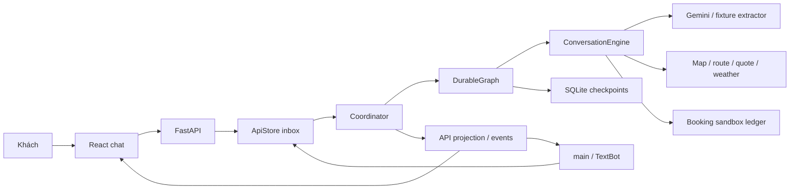

# Kiến trúc LangGraph và state ParrotGo

## 1. Thành phần và ranh giới

| Thành phần | Trách nhiệm | Nguồn |
| --- | --- | --- |
| HTTP API | Owner cookie, Origin, validation, receipt, polling và static UI. | [main.py](src/backend/app/main.py) |
| Text adapter | main/main_async/TextBot, session và timeout của caller. | [text.py](src/backend/app/text.py) |
| Inbox/API store | Dedup, thứ tự ingress, ACK, projection và retry metadata bền vững. | [api_store.py](src/backend/app/api_store.py) |
| Coordinator | Một writer mỗi phiên, claim/resume/publish và reconciliation. | [coordinator.py](src/backend/app/workers/coordinator.py) |
| DurableGraph | Ba node, checkpoint và tiếp tục đúng event/thread. | [builder.py](src/backend/app/graph/builder.py) |
| ConversationEngine | Booking/inquiry, apply toàn lượt, facts, consent và guard. | [conversation.py](src/backend/app/domain/conversation.py), [engine.py](src/backend/app/domain/engine.py) |
| InquiryService | Scope câu hỏi, read facts, candidate, resume/promote. | [inquiries.py](src/backend/app/domain/inquiries.py) |
| Adapters | NLU, địa điểm/tuyến, quote, forecast và effect sandbox theo contract. | [runtime.py](src/backend/app/runtime.py) |

Client/coordinator gửi input mới, không gửi state có quyền ghi đè checkpoint. Provider/model chỉ trả dữ liệu; code quyết định cập nhật state và thực hiện effect. Có thể đọc độc lập song song trong một lượt, nhưng không có nhiều agent tự do đặt xe.

## 2. Tên và contract dữ liệu

Versions thống nhất tại [bảng contract](MVP_PLAN.md#contracts).

| Tên | Bên gửi → nhận | Ý nghĩa |
| --- | --- | --- |
| MessageInput / ActionInput / AckInput | UI → HTTP API | Public input được validate, owner và dedup. |
| TurnInput | Graph/domain → extractor | Projection V2: năm trường NLU cơ sở, inquiry, prompt, capability và thời gian. |
| ExtractorTurnResult | Extractor → domain | Bí danh tài liệu của class TurnResult trong contracts/turn.py; gồm booking_acts/questions/inquiry_actions/conversational_acts/travel_party. |
| NluInput / NluResult | Flow legacy | Contract booking-slots-3; không giải mã output V2 bằng NluResult. |
| RuntimeState | Các node graph/checkpointer | TypedDict gồm state, incoming_event và interpretation. |
| State nghiệp vụ | Engine ↔ graph | Dict được tạo/migrate bằng new_state/new_conversation_state/migrate_state. |
| AssistantResponse / ChatSnapshot | API → UI | Phản hồi/projection công khai từ contracts/chat.py. |
| str | main/main_async/TextBot.ask → caller | Nội dung bot của event đã publication. |

Không gọi phản hồi graph/API là TurnResult: tên class này hiện dành cho kết quả extractor. State nghiệp vụ chưa có class Pydantic tên GraphState; các sơ đồ và bảng state dưới đây mô tả dict thực tế, không phải JSON model để client submit.

## 3. Registry 12 slot

Mỗi slot của BookingState có đúng value và confirmed. Null là chưa biết; không nhận null/confirmed=true. [] hoặc luggage count=0 có nghĩa đã nói không có, khác null. Sáu slot cốt lõi phải có trước create; optional đã cung cấp vẫn phải được xử lý, không âm thầm bỏ để vượt guard.

| Slot | Kiểu value khác null | Chính sách MVP |
| --- | --- | --- |
| pickup | string | Cốt lõi; điểm đón đã resolve. |
| destination | string | Cốt lõi; điểm đến đã resolve. |
| pickup_time | string | Cốt lõi; chỉ ASAP khách yêu cầu/xác nhận. |
| passengers | integer >= 1 | Cốt lõi; tổng người đi, gồm trẻ em, không gồm tài xế. |
| vehicle_type | string mã catalog | Cốt lõi; xe được chọn, có capacity/tariff/profile tương ứng. |
| contact_phone | string | Cốt lõi; chuẩn hóa/kiểm tra format, chưa OTP sở hữu. |
| contact_name | string | Hỏi khi đặt hộ; số liên hệ đúng người đi. |
| pickup_note | string | Validate và giữ; note đổi điểm hẹn phải làm mất hiệu lực dependency. |
| luggage | object count/size | Hỏi khi sân bay/capacity cần; count có thể null trong thông tin chưa hoàn chỉnh. |
| payment_method | string mã | Chỉ cash nếu khách chọn; không tự mặc định thanh toán. |
| stops | array string | Giữ yêu cầu và issue; multi-stop chưa bookable. |
| special_requests | array string mã | Giữ yêu cầu; child_seat/wheelchair_access/pet chưa được phục vụ. |

Các model/vocabulary chính xác trong [nlu.py](src/backend/app/contracts/nlu.py) và [registry.py](src/backend/app/contracts/registry.py). Luggage size nhận none/cabin/large/mixed/unknown; count=0 tương ứng chính xác size=none. unknown hoặc phần thiếu cần hỏi trước create nếu chưa đủ kiểm tra capacity.

Confirmed là bằng chứng khách đồng ý đúng giá trị/scope; geocode, prefill hoặc LLM extraction không tự là consent đặt xe. Giữ xác nhận của slot không bị sửa; payload/snapshot thay đổi làm consent tổng cũ mất hiệu lực.

## 4. State nghiệp vụ và checkpoint

| Nhóm state | Nội dung |
| --- | --- |
| booking_state / booking_status | 12 slot và tiến trình create/cancel/unknown. |
| conversation_context / candidates | Ngữ cảnh response đã ACK và projection candidate đang dùng. |
| control | session/draft IDs, schema/graph/policy/turn versions, booking_revision, slot_revisions, generation và last_event_id. |
| resolution | locations, candidate_sets, route, quote và contact của booking. |
| confirmation | pending_prompt, accepted_snapshot và slot_evidence của booking. |
| transaction | active_operation, booking_result, committed_snapshot và pending_cancel. |
| issues / turn | Issue bền vững và dữ liệu xử lý lượt. |
| last_response / response | Phản hồi/presentation hiện tại; publication xuất projection an toàn. |
| inquiries / active_inquiry_id | Tuyến hỏi thử riêng: ID/revision, raw endpoints, locations/candidates/routes/quotes, thời gian và TTL. |
| dialogue | pending_prompt có scope, suspended_booking_prompt, last_discussed_route_ref, pending_questions, booking_started. |
| travel_party | Metadata người lớn/trẻ em; không thêm slot mới. |
| read_requests / read_facts | Dữ liệu phụ trợ đọc có scope/binding trong state. |

Nguồn factory/migration là [conversation.py](src/backend/app/domain/conversation.py). Wrapper RuntimeState.state chứa state nghiệp vụ; interpretation là diễn giải đã checkpoint, incoming_event là event đang chạy. Client, HTTP socket, asyncio task/lock, API key, adapter/client và audio bytes không vào checkpoint.

Checkpoint là nguồn tiến trình. API projection là dữ liệu đọc publication. Ledger sandbox là nguồn đối soát effect đã commit. Không có transaction nguyên tử bao trùm business SQLite, checkpointer và provider; recovery dùng event/operation key ổn định.

## 5. Topology thực thi

| Node | Việc làm | Ranh giới |
| --- | --- | --- |
| interpret_turn | Engine.interpret: input V2, FAQ/typed bypass hoặc NLU, validate/evidence. | Interpretation được checkpoint trước node tiếp theo. |
| prepare_turn | Engine.prepare: áp dụng/chuẩn bị booking, inquiry và facts có binding. | State chuẩn bị được checkpoint trước finalize/effect. |
| process_turn | Engine.finalize hoặc reconcile: guard cuối, effect được phép và phản hồi. | Xóa incoming_event/interpretation khi lượt hoàn tất; coordinator publication. |

Engine legacy không có interpret/prepare dùng START → process_turn → END. Một phiên legacy pending/unknown vẫn đi qua flow nghiệp vụ tương thích, không bị ép migrate giữa effect.

Các bước apply_acts, resolve_context, integrate_resolution, decide_next_action, prepare_operation và render_response là trách nhiệm logic trong engine/services. Chúng không phải các node riêng trong graph hiện tại. Thêm node là thay topology/checkpoint boundary và phải xét version/resume.

END kết thúc một lượt graph, không kết thúc phiên hoặc hủy đơn. Replay sau crash trong node có thể lặp request đọc/model trước checkpoint; không tuyên bố mỗi inference chỉ chạy một lần.

## 6. Apply toàn lượt, inquiry và quyền xác nhận

1. Áp dụng ACK đúng response/generation; dựng prompt/scope đang được trả lời.
2. Diễn giải và validate toàn lượt: booking acts, questions, inquiry actions và travel party có evidence.
3. Hợp nhất sửa đổi/đính chính trước khi xét create/cancel; giữ issue chưa giải quyết.
4. Resolve/tính facts đúng booking hoặc inquiry, integrate theo revision/fingerprint/TTL.
5. Trả câu hỏi và làm rõ phần thiếu; chỉ effect khi consent và mọi guard cuối cùng còn hợp lệ.
6. Dựng phản hồi từ facts, checkpoint rồi publication/dedup kết quả.

Hỏi C→D không sửa booking A→B. Chọn candidate/xe của inquiry chỉ đổi inquiry. Use-inquiry-route là yêu cầu promote, chưa là consent create; phải kiểm tra inquiry/booking revision, TTL và route_fingerprint, lập summary mới rồi xác nhận riêng. Resume không phục hồi consent cũ đã mất scope.

Một “đồng ý” sau câu hỏi inquiry không xác nhận summary booking trước đó. “Đồng ý nhưng đổi xe” hoặc “đồng ý nhưng đi bao lâu?” không create trong lượt đó. Không giữ một consent bị câu hỏi/sửa đổi chặn để tự tạo ở lượt sau.

Guard create gồm slot/capability/capacity/contact hợp lệ; issue blocking đã giải; địa điểm/tuyến/quote còn đúng; summary/fingerprint/booking revision còn khớp; response có render evidence; prompt đúng scope; không input sửa/hủy mới hơn trước dispatch; không operation cũ pending/unknown/đã commit cho draft. Model hay nút UI không được bỏ qua các guard này.

## 7. Dependency và dữ liệu đọc

Map contract map-resolution-1 dùng status resolved/ambiguous/not_found/unavailable, place/candidates/binding; xem [map.md](map.md). Resolve là xác minh địa điểm, không confirmed và không ready_to_book.

Sửa pickup/destination/cổng hoặc note làm đổi điểm hẹn phải tăng revision phù hợp và vô hiệu route/quote/summary/consent phụ thuộc. Sửa số người/xe/hành lý/travel party ảnh hưởng capacity/payload cũng làm mất consent tổng. Chỉ đổi nhãn bảo toàn cùng thực thể không tự coi là một điểm mới.

Read facts có nguồn, request/scope/revision/fingerprint và TTL khi boundary tương ứng hỗ trợ. RouteResult gốc có pickup_id/destination_id/profile; scope/freshness bổ sung ở domain, không tự thêm field ngoài RouteResult. Kết quả stale hoặc sai scope không được ghi đè facts hiện tại. Thời tiết lỗi không thành “không mưa”; quote fixture và forecast fixture phải được nhận diện là mẫu.

## 8. Booking, ledger và recovery

BookingStatus vocabulary có collecting_info, awaiting_confirmation, booking_in_progress, booking_unknown, booking_failed, booked, cancel_pending, cancel_unknown, cancel_failed, amendment_pending, amendment_unknown và cancelled. Có enum amendment không có nghĩa runtime hỗ trợ sửa đơn đã tạo.

Provider sandbox [booking_sandbox.py](src/backend/app/adapters/booking_sandbox.py) lưu sandbox_bookings và sandbox_operations. Active operation và committed snapshot nằm trong state. Retry/lookup dùng key và payload đã chốt, không dựng lại từ slot mới hoặc cấp key ngẫu nhiên.

| Điểm gián đoạn | Hành vi |
| --- | --- |
| Input đã enqueue, chưa xử lý | Scanner/coordinator lấy lại từ inbox với event ID/thứ tự cũ. |
| Node còn dở | Resume đúng execution/thread/event; không reset state hoặc nhận lượt sau vượt pending event. |
| Interpretation đã checkpoint | Dùng diễn giải đã lưu, không inference lại chỉ để publication. |
| Prepare đã checkpoint, quote hết hạn trước dispatch | Guard cuối chặn effect mới; yêu cầu summary/consent mới. |
| Provider đã commit, graph chưa nhận kết quả | Lookup cùng key phục hồi kết quả; không tạo thêm booking. |
| Graph hoàn tất, API chưa publication | Materialize logical response/outcome và complete inbox idempotent. |
| Create/cancel timeout, outcome chưa rõ | Unknown và reconciliation; chưa tạo operation khác cho cùng draft. |

Ledger có commit cũ vẫn được phục hồi sau khi quote hết hạn; TTL chỉ chặn quyền gửi effect mới, không xóa giao dịch đã xảy ra. Cancel unknown phải đối soát chứ không báo đã hủy chắc chắn.

## 9. Delivery, ingress và concurrency

HTTP render ACK gắn response_id/generation; stale ACK không cập nhật prompt mới. ACK không có nghĩa consent. Candidate/select/confirm vẫn kiểm tra ID, scope, revision và TTL tại worker. Request ghi được owner/Origin guard và chỉ public DTO cần thiết ra UI.

ApiStore lưu api_sessions/api_inbox/api_events/api_acks/api_meta/api_reconciliation/api_turn_retries. Coordinator mặc định concurrency=4 giữa các phiên, một task/writer mỗi session. Trong MVP chỉ chạy một process với workers=1 và một runtime cho mỗi cặp database. Muốn nhiều process phải triển khai scheduling/lease/fencing và storage phù hợp trước.

TextBot dùng text.sqlite/text_checkpoints.sqlite riêng. Khi caller gọi lượt sau, mặc định acknowledge_previous=True; tích hợp TTS phải chờ phát nội dung trước khi ACK. Timeout của TextBot giữ input trong inbox; retry cùng message_id để lấy kết quả, không tạo input khác.

## 10. Ngân sách và lỗi

Gemini mặc định một inference/lượt thông thường; FAQ allowlist và typed actions không inference. Nếu caller bật budget 2, chỉ tối đa một repair trong cùng deadline/quota. Không có LLM planner bắt buộc. Gemini limiter SQLite giữ rolling 60 giây, mặc định 15 RPM cho mọi phiên/evaluation dùng cùng database.

Quota/429 giữ event waiting_for_quota, cooldown/retry_at và tự tiếp tục; không tính là fault retry. Lỗi node có budget tối đa 3 lần trước needs_support/exhausted; giao dịch/checkpoint còn dở được giữ. Unknown reconciliation tối đa 5 lượt theo policy. Lỗi provider live không fallback sang fixture.

LLM timeout mặc định 25 giây, read request 5 giây, nhánh đọc 15 giây; đây là cấu hình trong [config.py](src/backend/app/config.py), không phải SLA. Timeout audio/caller không được dùng để kết luận giao dịch thất bại.

## 11. Migration, dữ liệu và vận hành

Phiên mới schema 5, parrotgo-turn-2, chat-graph-2/mvp-chat-policy-2, chat-api-2/chat-presentation-2. Registry booking-slots-3 và map-resolution-1 vẫn giữ boundary đã mô tả. migrate_state không nâng phiên booking_in_progress/booking_unknown/cancel_pending/cancel_unknown; các phiên khác migrate ở ranh giới an toàn, giữ IDs/slot values, vô hiệu pending consent thiếu scope, không tự tăng confirmed.

Giữ runner tương thích để đối soát phiên cũ. Rollback code/capability không hoàn tác effect đã commit; không reset DB hay ép giải mã checkpoint V2 bằng schema cũ.

Business/checkpoint/quota data và APP_SECRET cần backup cùng cấu hình khi dừng backend. Secrets/client/socket/audio không xuất vào prompt/public state. Hướng dẫn lệnh và đường dẫn tại [README.md](README.md); phạm vi/bảng dữ liệu và công việc nhiều process tại [MVP_PLAN.md](MVP_PLAN.md).

## 12. Kiểm chứng hiện tại và ma trận mở rộng

409 pytest và 6 browser E2E xác minh development; xem [MVP_STATUS.md](MVP_STATUS.md). Ma trận V2 có scope/inquiry/map/weather/quota và mục tiêu holdout tại [MVP_PLAN.md](MVP_PLAN.md). Tests về recovery dùng process thật để kiểm tra commit/checkpoint/publication, không chỉ mock kết quả cuối.

Ma trận dưới đây giữ các tình huống thiết kế nền. Các hàng về đặt trước/stops/amendment/hồ sơ/voice là yêu cầu mở rộng; capability chưa hỗ trợ phải giữ issue và giải thích giới hạn, không được coi mọi hàng là tính năng đã triển khai. Thuật ngữ act trong bảng mô tả nghiệp vụ; payload V2 cụ thể theo llmextractor.md.

| # | Tình huống | Kết quả bắt buộc |
| --- | --- | --- |
| 1 | Một câu cung cấp nhiều slot cốt lõi và tùy chọn | Nhận mọi act hợp lệ, tính điều kiện còn thiếu, resolve và tóm tắt khi đủ; chưa tự đặt |
| 2 | Đang hỏi giờ nhưng khách bổ sung địa chỉ | Ghi đúng slot địa chỉ, sau đó tiếp tục hỏi giờ |
| 3 | “Ừ, nhưng đổi thành 4 giờ” | Xác nhận phần không đổi, reset giờ và snapshot |
| 4 | “Không phải 36, là 63 Hoàng Cầu” | Một thay đổi pickup cuối cùng; không geocode cả giá trị đã bác bỏ |
| 5 | “3 giờ, à 4 giờ” so với “3 hoặc 4 giờ” | Phân biệt đính chính rõ với lựa chọn mơ hồ |
| 6 | “Hai” khi hỏi giờ / số người / chọn candidate | Diễn giải theo scope: giờ / integer 2 / candidate ID; thiếu bằng chứng thì hỏi lại |
| 7 | Confirm không có pending prompt hợp lệ | Không xác nhận toàn bộ booking |
| 8 | Confirm tổng kèm câu hỏi giá | Trả lời và xác nhận lại trước commit |
| 9 | “Sai rồi” sau câu tổng kết | Hỏi phần nào sai; giữ dữ liệu còn dùng được |
| 10 | Chọn candidate rồi bổ sung pickup | Áp dụng cả hai acts, xóa đúng tập đã chọn |
| 11 | Chọn ID không tồn tại hoặc tập cũ | Bác lựa chọn, không cập nhật nhầm slot |
| 12 | Cả hai địa chỉ đều mơ hồ | Lưu hai tập; trình bày và xử lý lần lượt |
| 13 | Reject một candidate hoặc tất cả | Loại đúng lựa chọn; hết thì hỏi tiêu chí mới |
| 14 | Map không tìm thấy / Map lỗi mạng | Phản hồi và retry khác nhau |
| 15 | Đổi xe nhưng địa chỉ giữ nguyên | Không geocode lại; kiểm tra route/khả dụng/quote phù hợp |
| 16 | Quote hết hạn sau khi bot đọc tóm tắt | Không đặt với snapshot hết hiệu lực; báo giá lại và hỏi đồng ý |
| 17 | Giờ quá khứ, thiếu ngày hoặc thiếu sáng/chiều | Hỏi rõ; không tự chọn timestamp thuận tiện |
| 18 | Low confidence nhưng có act `cancel` | Xác minh lời nói; chưa gọi cancel |
| 19 | Im lặng hoặc noise nhiều lượt | Giữ slot; bộ đếm và fallback hữu hạn |
| 20 | LLM sai JSON hoặc tự thêm intent | Reject theo validator; không thực hiện act lạ |
| 21 | Chit-chat, ngoài phạm vi, yêu cầu nhắc lại | Không mất draft; quay về câu hỏi hiện hành |
| 22 | Ngắt câu xác nhận giữa chừng | Dừng TTS, vô hiệu hóa chốt từ câu “ừ” mơ hồ |
| 23 | Kết quả geocode cũ tới sau khi sửa địa chỉ | Bỏ theo source revision |
| 24 | Kết quả create cũ tới sau khi ngắt lời | Vẫn ghi ledger và đối soát, chỉ bỏ phản hồi audio cũ |
| 25 | Event transcript hoặc callback trùng | Không áp dụng act/giao dịch/response hai lần |
| 26 | Hai worker xử lý cùng session | Một writer/dispatcher hợp lệ qua lease và fencing |
| 27 | Crash sau provider success, trước checkpoint | Khôi phục từ ledger/provider bằng cùng key |
| 28 | Timeout create, khách nói “đặt lại đi” | Đối soát trước; không tạo lần hai khi outcome chưa rõ |
| 29 | Hủy trước create / sau create | Bỏ draft / gọi Cancel API tương ứng |
| 30 | Cancel thất bại hoặc timeout | Giữ booking và trạng thái thật; không thông báo đã hủy |
| 31 | Sửa chuyến sau khi đã đặt | Dùng amendment; chỉ commit snapshot mới sau success |
| 32 | Callback success cũ tới sau cancel success | Không phục hồi trạng thái booked từ event cũ |
| 33 | Mất kết nối khi giao dịch đang chạy | Session đóng, đối soát vẫn tiếp tục |
| 34 | TTS phát xong nhưng ACK chưa được tích hợp | Xử lý quan hệ event; thiếu bằng chứng thì xác nhận lại |
| 35 | Nội dung yêu cầu bỏ validation/gọi tool tùy ý | Chỉ trích xuất dữ liệu hợp lệ, policy không bị thay |
| 36 | Deployment đổi tên node/state khi thread còn dở | Giữ phiên bản cũ hoặc migrate tại điểm an toàn |
| 37 | Bot hỏi riêng pickup, khách “đúng rồi” | Chỉ pickup được xác nhận mới; không xác nhận cả booking |
| 38 | Bot hỏi tổng, khách “đúng địa chỉ đón thôi” | Thu hẹp phạm vi vào pickup; không cấp chấp thuận giao dịch |
| 39 | Bot hỏi giờ, khách “đúng rồi, à thôi 4 giờ” | Giờ mới chưa confirmed; không dùng lời đồng ý giờ cũ |
| 40 | Bot hỏi loại xe, khách xác nhận xe rồi sửa pickup | Giữ xác nhận xe, sửa/reset pickup; giữ slot khác còn hợp lệ |
| 41 | “Địa chỉ đúng, còn giờ tôi chưa chắc” | Giữ giờ như phương án tạm, reset xác nhận giờ; hỏi làm rõ |
| 42 | “Đặt đi, nhưng đổi sang xe 7 chỗ” | Không đặt bản cũ hoặc tự đặt bản mới; kiểm tra giá và xác nhận lại |
| 43 | “Nếu giá thấp hơn thì đổi xe” | Không áp dụng như lệnh đổi vô điều kiện; giải quyết điều kiện trước |
| 44 | STT tách “đúng rồi” và “nhưng đổi…” thành hai đoạn final | Ghép khi còn cùng lượt; nếu đến muộn thì chặn dispatch hoặc xử lý amendment tùy thời điểm |
| 45 | NLU chỉ trả confirm dù transcript có giới hạn/phủ định | Bộ kiểm tra ngữ nghĩa chặn khi phát hiện mâu thuẫn; đo lỗi bỏ sót thay vì giả định JSON đúng là ý đúng |
| 46 | Khách sửa một slot đã xác nhận ở nhiều lượt trước | Chỉ reset slot bị tác động và dependency; giữ các xác nhận khác nhưng lấy lại đồng ý giao dịch |
| 47 | Có đủ sáu slot cốt lõi; không có điều kiện bổ sung | Cho phép đi đến xác nhận/create khi các guard đạt; không buộc điền đủ 12 slot |
| 48 | Đi sân bay nhưng chưa biết hành lý | Hỏi hành lý theo policy; không tự ghi count = 0 |
| 49 | Khách nói “2 người” rồi sửa thành “5 người” | Nhận integer 5; giữ lựa chọn xe nhưng kiểm tra lại capacity, chặn nếu không đủ; xin đồng ý xe/giá mới |
| 50 | “Xe 7 chỗ” nhưng chưa biết số khách | Không điền passengers = 7; hỏi số người |
| 51 | “Hai người lớn, hai trẻ em” | passengers = 4; kiểm tra nhu cầu hỗ trợ theo lời khách/policy, không bỏ trẻ em khỏi tổng |
| 52 | Số khách vừa xe nhưng nhiều vali lớn | Kiểm tra sức chứa kết hợp; đề nghị phương án phù hợp, không chỉ xét ghế |
| 53 | Đặt hộ mẹ, tài xế cần gọi số khác | Thu thập contact_name/contact_phone của người đi; không dùng số hồ sơ người gọi thay thế |
| 54 | Dùng số đăng ký đã có trong hồ sơ | Prefill reference chưa confirmed; xác nhận cách liên hệ, pin profile version, không hỏi lại toàn bộ số |
| 55 | Chỉ sửa số điện thoại sau báo giá | Resolve/xác nhận số mới, vô hiệu hóa snapshot; giữ Map/quote nếu dependency cho phép |
| 56 | “Đón cổng sau” làm thay đổi tọa độ điểm hẹn | Sửa pickup và ghi chú, resolve/quote lại; không chỉ thêm text vào audit |
| 57 | Thêm hoặc đảo thứ tự hai điểm dừng | Giữ danh sách đầy đủ theo ý khách; tăng revision, bỏ candidate cũ, tính lại tuyến/giá |
| 58 | “Bỏ hết điểm dừng, không mang vali” | Dùng [] và {count: 0, size: none}; phân biệt với null, xác nhận lại thay đổi |
| 59 | Thanh toán bằng phương thức provider không hỗ trợ | Giữ issue, hỏi phương thức khác; không tự chuyển sang tiền mặt |
| 60 | Cần xe hỗ trợ xe lăn nhưng provider chỉ nhận ghi chú | Chặn create/handoff hoặc xin đồng ý phương án đáp ứng; không hứa dịch vụ chỉ từ việc gửi note |
| 61 | Provider không truyền được pickup_note đã xác nhận | Không âm thầm bỏ ghi chú; giải quyết với khách trước dispatch |
| 62 | `passengers = true`, chuỗi "2", object luggage thiếu key hoặc code lạ | Contract validator từ chối; không ép kiểu âm thầm thành payload |
| 63 | Profile đổi số trong lúc chờ đồng ý | Dùng bản liên hệ đã pin hoặc yêu cầu xác nhận lại; không thay payload sau consent |
| 64 | Migrate draft cũ có bốn slot đã confirmed | Giữ bằng chứng hợp lệ của slot cũ, thêm slot mới null/false; thu thập còn thiếu và xin consent mới |
| 65 | Khách nói “có vali lớn”, lượt sau trả lời “hai” | Giữ size = large khi count còn null, hỏi đúng số lượng rồi cập nhật count = 2; không mất dữ liệu từng phần |
| 66 | Khách nói đặt hộ, lượt sau chỉ bổ sung giờ | Giữ collection_context và điều kiện cần tên/liên hệ người đi; không quên yêu cầu sau khi reset turn |

Các đối chứng bắt buộc: đồng ý không sửa sau summary/ACK hợp lệ tạo đúng một đơn; đồng ý kèm sửa/câu hỏi tạo 0 đơn; retry/restart không nhân đôi effect; inquiry đúng scope không đổi booking; decline/unknown/stale không bị hiểu thành success. Đo latency theo ingress, queue, NLU, read, publication; số liệu mục tiêu không phải kết quả đã đạt.

## 13. Các thay đổi cần đồng bộ khi mở rộng

Thay model/prompt/provider phải pin cấu hình và eval; giữ shape không đủ bảo đảm chất lượng. Thay input/output, state, tên node hoặc consent phải tăng đúng contract/state/graph/policy version, có migration/resume và cập nhật fixtures/API types/tài liệu. Không gom tất cả version vào một nhãn V2.

Voice mở rộng cần Worker ghép lượt final, playback ACK riêng, generation/fencing và audio orchestrator như [llmplanner.md](llmplanner.md); HTTP render evidence hiện tại không tự chứng minh khách đã nghe. Amendment, multi-stop, giá/booking thật và nhiều process theo backlog duy nhất trong [MVP_PLAN.md](MVP_PLAN.md).
